<style>
    p { font: 0.875rem YaHei !important; }
</style>

# Design Pattern

 23 classification and list

## Creational patterns

### Abstract factory
抽象工厂模式，提供一个用于创建相关或依赖对象族的接口，而无需指定其具体类。
**使用场景**：当一个场景需要引入多个接口，尤其是针对不同资源要绑定不同的对象时。例如：一个`player`加入战场的时候要分配装备，而且不同`阵营`的`player` 分配的装备型号不同。
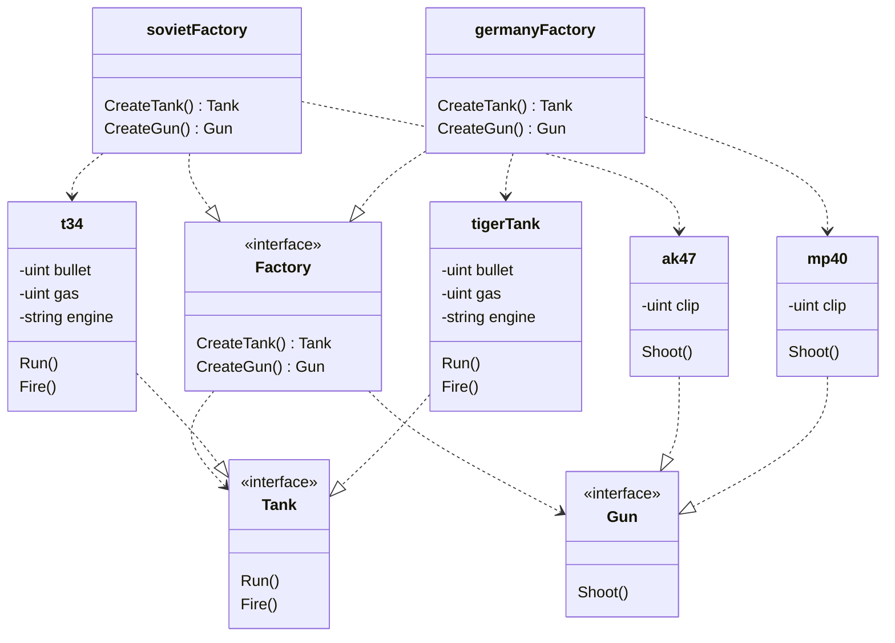
```mermaid!
classDiagram
class Factory {
    CreateTank() Tank
    CreateGun() Gun
}
<<interface>> Factory

class Tank{
    Run()
    Fire()
}
<<interface>> Tank

class Gun{
    Shoot()
}
<<interface>> Gun

class sovietFactory{
    CreateTank() Tank
    CreateGun() Gun
}

class t34 {
    -uint bullet
    -uint gas
    -string engine
    Run()
    Fire()
}

class ak47 {
    -uint clip
    Shoot()
}

class germanyFactory{
    CreateTank() Tank
    CreateGun() Gun
}

class tigerTank{
    -uint bullet
    -uint gas
    -string engine
    Run()
    Fire()
}

class mp40 {
    -uint clip
    Shoot()
}

Factory ..> Tank
Factory ..> Gun

sovietFactory ..|> Factory
sovietFactory ..> ak47
sovietFactory ..> t34
t34 ..|> Tank
ak47 ..|> Gun

germanyFactory ..|> Factory
germanyFactory ..> mp40
germanyFactory ..> tigerTank
tigerTank ..|> Tank
mp40 ..|> Gun
```

调用方不需要了解实例化过程和接口对应的实现类，只要能`Tank`可以开、`Gun`可以射击，他只需要找到正确的`factory`。golang的示例代码如下：
``` go
type Factory interface{
    CreateTank() Tank
    CreateGun() Gun
}

type Tank interface{
    Fire()
    Run()
}

type Gun()interface{
    Shot()
}

type sovietFactory struct{
}

func (sf *sovietFactory) CreateTank() Car{
    return &t34{
        gas: 700 
        engine: "t34"
        bullet: 50
    }
}

func (sf *sovietFactory) CreateGun() Gun {
    return &ak47{
        clip: 10000
    }
} 

type t34 struct {
    gas uint64
    bullet uint64
    engine string
}

func (t *t34)Run(){
    t.gas--
}

func (t *t34)Fire(){
    t.bullet--
}

type ak47 struct{
    uint64 clip
}

func (a *akf7)Shot(){
    a.clip--
}

type germanyFactory struct{
}

func (gf *germanyFactory) CreateTank() Car{
    return &tigerTank{
        gas: 1000
        engine: "tiger"
        bullet: 60
    }
}

func (gf *germanyFactory) CreateGun() Gun {
    return &mp40{
        clip: 8000
    }
} 

type tigerTank struct {
    gas uint64
    bullet uint64
    engine string
}

func (t *tigerTank)Run(){
    t.gas--
}

func (t *tigerTank)Fire(){
    t.bullet--
}

type mp40 struct{
    uint64 clip
}

func (a *mp40)Shot(){
    a.clip--
}

func openFactory(power string) (f Factory) {
    switch power {
        case `soviet`:
            f = &sovietFactory{}
        case `germany`:
            f = &germanyFactory{}
        default:
            f = nil
    }

    return f
}

// caller
if f := openFactory(player.power); f != nil {
    tank := f.CreateTank()
    player.vehicle = tank
    player.weapon.cannon = tank
    player.weapon.gun = f.CreateGun()
}
```

这种设计模式的优缺点显而易见：
+ 优点： 将对象的创建的具体流程与调用方完全屏蔽，调用方无需做额外工作，只要保证调用正确的factory就好了；
+ 缺点： 引入额外的封装代码，尤其当生产类型组合过多的时候，需要实现多种 factory。对调用方约束性较强，当调用方需要某些特性未暴露时，无法通过自己封装创建方法实现；

### Builder
构建器模式，将复杂对象的构造与其表示分开，从而允许相同的构造过程创建各种表示。
**使用场景**：适用于构造一些初始化可变选项特别多的对象，而其中一些选项对某个资源是相同的。例如：`player`在注册游戏时创建了一个`role`，同时还可以选择不同的职业加入战场。
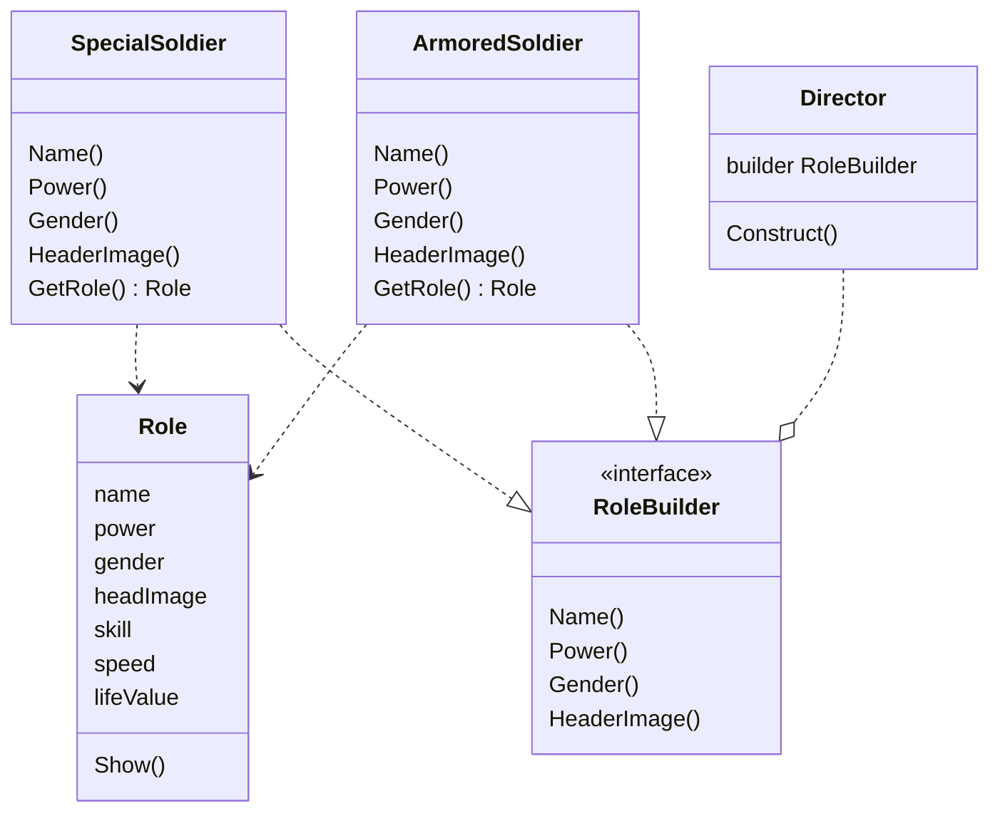
```mermaid!
classDiagram
class RoleBuilder{
    Name()
    Power()
    Gender()
    HeaderImage()
}
<<interface>> RoleBuilder

class Role{
    name
    power
    gender
    headImage
    skill
    speed
    lifeValue
    Show()
}

class SpecialSoldier{
    Name()
    Power()
    Gender()
    HeaderImage()
    GetRole() Role
}

class ArmoredSoldier{
    Name()
    Power()
    Gender()
    HeaderImage()
    GetRole() Role
}

class Director{
    builder RoleBuilder
    Construct()
}

Director ..o RoleBuilder
SpecialSoldier ..> Role
ArmoredSoldier ..> Role
ArmoredSoldier ..|> RoleBuilder
SpecialSoldier ..|> RoleBuilder
```

golang 的示例代码如下：
``` go
type Builder interface {
    Name(name string)
    Power(power string)
    Gender(gender string)
    HeaderImage(headImage string)
}

type Role struct {
    name string
    power string
    gender string
    headImage string
    skill string
    speed uint32
    lifeValue uint64
}

func (r *Role)Show(){
    fmt.Println(*r)
}

type builder struct{
    Role
}

func (b *builder) Name(name string){
    b.name = name
}

func (b *builder)Power(power string){
    b.power = power
}

func (b *builder)Gender(gender string){
    b.gender = gender
}
 
func (b *builder)HeaderImage(headImage string){
    b.headImage = headImage
}

type SpecialSoldier struct{
    builder
}

func (ss *SpecialSoldier)GetRole()(r Role) {
    r = ss.role
    r.skill = "everything"
    r.speed = 50
    r.lifeValue = 150
}

type ArmoredSoldier struct{
    builder
}

func (as *ArmoredSoldier)GetRole()(r Role) {
    r = as.role
    r.skill = "driving tanks"
    r.speed = 30
    r.lifeValue = 100
}

type Director struct{
    builder RoleBuilder
}

func (d *Director)Construct(){
    d.builder.Name("panda")
    d.builder.Gender("male")
    d.builder.Power("China")
    d.builder.HeadImage("panda.icon")
}

func NewDirector(b builder) *Director{
    return &Director{
        builder: builder
    }
}

// caller
specialSoldier := &SpecialSoldier{}
NewDirector(specialSoldier).Construct()
pandaSpecSoldier := specialSoldier.GetRole()

armoredSoldier := &ArmoredSoldier{}
NewDirector(armoredSoldier).Construct()
pandaArmSoldier := armoredSoldier.GetRole()
```
在上面的示例代码中利用`golang的组合特性`（*）减少重复性的代码。对于一个职业（`Special Soldier`、`Armored Soldier`等），无论是哪个用户，都可以获得相同属性的角色。

该设计模式的优缺点如下：
+ 优点：调用方可以去按需修改对象内部的成员，控制构造流程；
+ 缺点：每一个种 Product 都要构造一个对应的 Builder，且必须是可变的。

在`golang`中或其他语言中`Builder`还有一种常见的，也十分‘有趣的’使用方法：
``` go
type Role struct {
    name string
    power string
    gender string
    headImage string
}

type builder struct{
    Role
}

func (b *builder)Name(name string)*builder{
    b.name = name
    return b
}

func (b *builder)Power(power string)*builder{
    b.power = power
    return b
}

func (b *builder)Gender(gender string)*builder{
    b.gender = gender
    return b
}
 
func (b *builder)HeaderImage(headImage string)*builder{
    b.headImage = headImage
    return b
}

func (b *builder)GetRole()Role{
    return b.Role
}

func (b*builder)Builder() *builder{
    new := *b
    return &new
}

// caller
builder := &builder{}.Gender("male").Power("china")
panda := builder.Builder().Name("panda").HeadrImage("panda.icon").GetRole()
long := builder.Builder().Name("long").HeadrImage("long.icon").GetRole()
```
这种使用方法一定要注意，在`GetRole()`时返回一个结构体而不是结构体指针，否则构建新对象时容易对已经构造的对象造成污染。使用这种方法的好处是，可以通过‘继承’前一个`builder`，减少大量重复的成员变量赋值，而且也是并发安全的。

### Dependency Injection
依赖注入模式，类通过一个注入器来代替直接创建依赖的对象，是增加代码可扩展性常用的手段。
**使用场景**：简单的说调用方的实现依赖于某个类或服务，该类或服务是它实现上的一个有效组成部分，需要在初始化或者某个流程步骤将依赖类的对象传递给调用方。例如：`player`在一个游戏中需要切换不同的游戏模式。

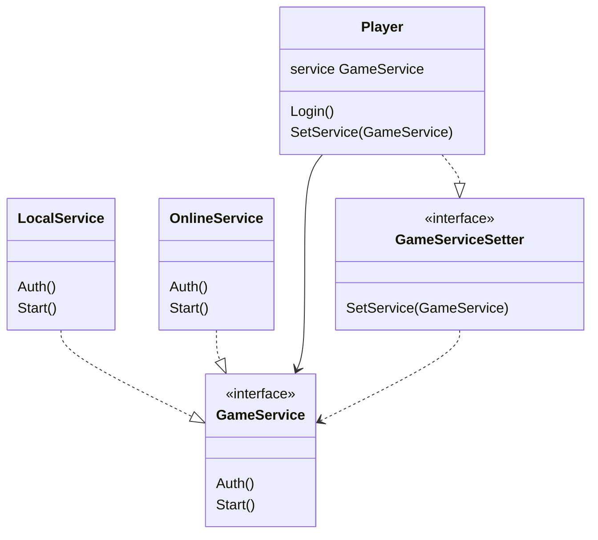
```mermaid!
classDiagram
class Player{
    service GameService
    Login()
    SetService(GameService)
}

class GameServiceSetter{
    SetService(GameService)
}
<<interface>> GameServiceSetter

class GameService{
    Auth() 
    Start()
}
<<interface>> GameService

class LocalService{
    Auth() 
    Start()
}

class OnlineService{
    Auth() 
    Start()
}
LocalService ..|> GameService
OnlineService ..|> GameService
Player-->GameService
GameServiceSetter..>GameService
Player..|>GameServiceSetter
```
golang的示例代码如下：
``` go
type GameService interface{
    Auth(name, passwd string) bool
    Start()
}

type GameServiceSetter interface{
    SetService(srv GameService)   
}

type srvSetter struct{
    srv GameService
}

func (ss *srvSetter)SetService(srv GameService){
    ss.srv = srv
}

type player Struct{
    name string
    passwd string
    srvSetter
}

func (p *player)Login(){
    if p.srv != nil{
       if p.srv.Auth(p.name, p.passwd){
           p.srv.Start()
       }
    }
}

type LocalService struct {
}

func (s *LocalService) Auth(name, passwd string) bool{
    // TODO
    return true
}

func (s *LocalService) Start() {
    // TODO
    return
}

type OnlineService struct {
}

func (s *OnlineService) Auth(name, passwd string) bool{
    // TODO
    return true
}

func (s *OnlineService) Start() {
    // TODO
    return
}

func SelectService(mode string,s GameServiceSetter){
    switch mode{
    case `online`:
        s.SetService(&OnlineService{})
    case ``: 
        s.SetService(&LocalService{})
    default:
        // TODO
    }
}

// caller
panda := &Player{name:"panda", passwd:"passwd"}
SelectService("online", panda)
panda.Login()
```

通常情况下`GameServiceSetter`这一层抽象是被省略的，经常被以下的模式替代：

``` go
func NewPalyer(..., srv GameService)(p *Player){
    ...
    p.srv = srv
}

// OR

func (p *Player)SetGameService(srv GameService){
    p.srv = srv
}

// OR

type Option func(*Player) 

func WithService(srv GameService){
    return func(p *Player){
        p.srv = srv
    }
}

func NewPlayer(..., ops ... Option)(p *Player){
    ...
    for _, op := range ops{
        op(p)
    }
}
```
将 `GameServiceSetter` 单独的实现，通过组合（*）的方式放在结构体里面也不是必须的，多加一层抽象可以使代码迭代和扩展性上更好，但同时也会引起维护和理解上的困难。
以上替代方案中，第三种方案在 `golang package` 中对于接口的兼容和维护十分有效。

优缺点如下：
+ 优点：在调用方对象的生命周期内，可以通过更换依赖的服务对象来进行模式切换，而不用关心底层具体实现；
+ 缺点：调用方要保障注入时机的可控性，否则可能调用一个未注册的空对象；

### Factory method
工厂模式，定义用于创建单个对象的接口，将实例化创建部分放在子类实现，让子类决定实例化哪个类。

**使用场景**：当获取的资源对象可以通过另一个对象构造和管理时，适合使用工厂模式。例如：`player`在`Game`中创建一个 `Room`，可以选择不同的对战模式。
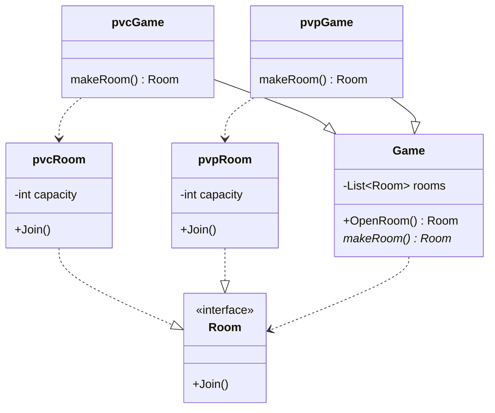
```mermaid!
classDiagram
class Room{
    +Join()
}
<<interface>> Room

class pvpRoom{
    -int capacity
    +Join()
}

class pvcRoom{
    -int capacity
    +Join()
}

%% makeRoom is <<interface>> function
class Game{
    -List~Room~ rooms
    +OpenRoom() Room
    makeRoom()* Room 
}

class pvcGame{
    makeRoom() Room
}

class pvpGame{
    makeRoom() Room
}

pvcRoom ..|> Room
pvcGame..>pvcRoom
pvcGame--|>Game
pvpRoom ..|> Room
pvpGame..>pvpRoom
pvpGame--|>Game
Game..>Room
```

golang的示例代码如下：
``` go
type Room interface{
    Join()
}

type pvcRoom struct{
    capacity int
}

func (p* pvcRoom)Join(){
    // TODO
}

type pvpRoom struct{
    capacity int
}

func (p* pvpRoom)Join(){
    // TODO
}

type roomMaker interface {
    makeRoom() Room
}

type Game struct{
    rooms []Room
    roomMaker
}

func (g *Game)OpenRoom() Room{
    r := g.makeRoom()
    g.rooms = append(g.rooms, r)
    return r
}

type pvpGame struct{
}

func (pvp *pvpGame)makeRoom(){
    return &pvpRoom{capacity: 10}
}

type pvcGame struct{
}

func (pvc *pvcGame)makeRoom(){
    return &pvcRoom{capacity: 5}
}

func NewPVPGame() *Game{
    return &Gmame{
        roomMaker: &pvpGame
    }
}

func NewPVCGame() *Game{
    return &Gmame{
        roomMaker: &pvcGame
    }
}

// caller
pvpGame := NewPVPGame()
room := pvpGame.OpenRoom()
```
由于golang没有类似虚基类的语法特性，无法实现类图中所展示的关系，只能通过类似`Dependency Injection`的方式来模拟。

其优缺点如下：
+ 优点：将类的构造与调用方隔离，实现解耦合。将底层具体类型的构造实现交给继承的子类，通过拓展子类就可以实现更多工厂类型；
+ 缺点：额外的封装增加开发成本，如果只是简单的几种类型，建议使用`switch`代替。

### Lazy Initialization
懒汉模式：将对象的创建，值的计算或其他昂贵的过程延迟到第一次使用时的策略。此模式在GoF目录中显示为“虚拟代理”，这是代理模式的一种实施策略。

**使用场景**：当访问的资源比较昂贵，而资源又未必一定会被访问的情况下可以使用懒汉模式。例如：`player`在`Game`中请求开启了超清画质模式，该模式需要启动超高清计算引擎。

golang示例代码如下：
``` go

var (
    lowGraphEngine = NewEngine(`lowlevel`)
    commonGraphEngine = NewEngine(`common`)
    highGraphEngine Engine
    once sync.Once
    nowEngine Engine
)

func SwitchEngine(engine string){
    switch engine{
        case `lowlevel`:
            nowEngine=lowGraphEngine
        case `commonlevel`:
            nowEngine=commonGraphEngine
        case `highlevel`:
            // TODO: add lock
            if highGraphEngine == nil {
                highGraphEngine = NewEngine(`highlevel`)
            }
                
            nowEngine=highGraphEngine
        default: 
            // TODO
    }
}  
```

如上示例代码所示，只有在选择开启`highlevel`时候才会去初始化 `highGraphEngine`，示例代码中没有加锁进行资源保护，并非多线程安全的，实际使用时要注意。

### Multiion

### Object pool
对象池模式，经常在各种sdk中见到，主要作用是将资源池化，通过回收再利用的模式，避免频繁创建对象引入的消耗，同时也能减轻对象访问资源的压力。

**使用场景**: 通过socket访问存储服务，调用远程http/https服务等。例如：游戏`client`与`server`频繁的进行数据交换。

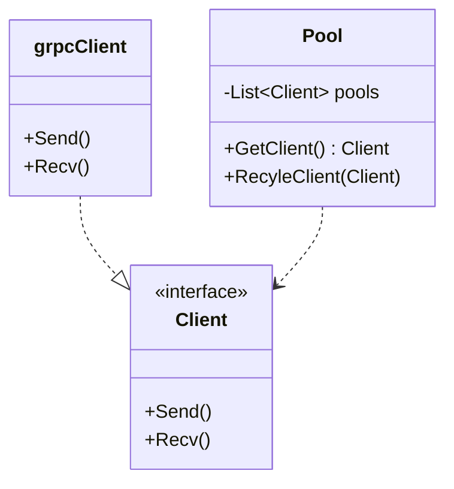
```mermaid!
classDiagram
class Pool {
    -List~Client~ pools
    +GetClient() Client
    +RecyleClient(Client) 
}

class Client{
    +Send()
    +Recv()
}
<<interface>> Client

class grpcClient{
    +Send()
    +Recv()
}

grpcClient..|>Client
Pool..>Client
```

golang的示例代码如下：

``` go

type Client interface{
    Send([]byte)
    Recv([]byte)
}

type grpcClient struct{
}

func ( *grpcClient)Send(data []byte){
    //TODO
}

func ( *grpcClient)Recv(data []byte){
    //TODO
}

type ClientPool struct {
    pools chan Client
    conn func() (Client, error)
}

func (p *ClientPool)GetClient(ctx context.Context)(c Client, err error){
    tCtx, cancel := context.WithTimeout(ctx, p.timeOut)
    defer cancel()
    select {
    case c = <-p.pools:
    case <-tCtx.Done():
        err = tCtx.Error()
    }
    return 
}

func (p *ClientPool)RecyleClient(c Client){
    select{
    case p.pools <- c:
    default:
    }
}

// callers:
c, _ := pool.GetClient(context.Background())
c.Send([]byte("hello world"))
pool.RecycleClient(c)
```

资源池化模式是在各种driver sdk中必定出现的一种模式，主要的目的就是尽量复用与远程服务之间的tcp链接，这样做的好处 ：一、减少重复建立链接带来的时间延迟（三次握手、四次挥手）；二、减少服务端维持链接的开销（mysql社区版中每条链接都会起一个服务线程）。
上面的示例属于比较*简陋*的链接池实现，仅仅实现了复用的功能，不具备弹性扩容、空闲统计、心跳检测的功能。

### Prototype 
原型模式，指定使用原型实例创建的对象类型，并从现有对象的“骨架”创建新对象，从而提高性能并将内存占用量降至最低。简单的来讲就是“复制-粘贴”模式。

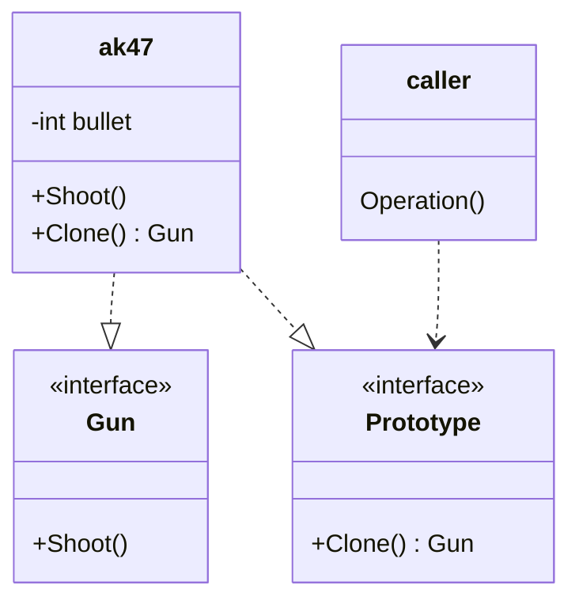
```mermaid!
classDiagram

class Gun{
    <<interface>>
    +Shoot()
}

class Prototype{
    +Clone() Gun
}
<<interface>> Prototype

class ak47{
    -int bullet
    +Shoot()
    +Clone() Gun
}

class caller{
    Operation()
}

ak47 ..|> Gun
ak47 ..|> Prototype
caller ..> Prototype
```

golang 示例代码如下：
``` go
type Gun interface {
    Shoot()
}

type Prototype interface {
    Clone() Gun
}

type ak47 struct {
    bullet int
}

func (a *ak47)Shoot(){
    //TODO
}

func (a *ak47)Clone()Gun{
    cp := *a
    return &cp
}

// caller
var proto Prototype = &ak47{bullet:10000}
gun := proto.Clone()
```
这种写法与上面的`builder`示例很相似，实际上也确实有一个偷懒的做法，即将对象本身作为自己的`builder`：
``` go
type ak47 struct {
    bullet int
}

func (a *ak47)Bullet(b int) *ak47{
    a.bullet = b
    return a
}

func (a *ak47)Shoot(){
    //TODO
}

func (a *ak47)Clone()Gun{
    cp := *a
    return &cp
}

// caller
gun := &ak47{}.Bullet(10000).Clone()
```
对于这种写法，作者并不持推荐态度。虽然它节省了工作量，但是会对使用方造成很大的麻烦，使用方要时刻谨小慎微，以保证对象不会被重用，而且一旦出现问题很难排查。

同时作者认为设计模式是灵活多变的，有时一种设计模式可以成为另一种模式的实现，比如抽象工厂模式就可以通过原型模式来实现，而原型模式又可以通过单例模式来实现。

### Resource acquisition is initialization

### Singleton
单例模式，确保一个类只有一个对象，提供一个全局的变量去访问它。
这种模式在`golang`开发的常驻服务类型的软件工程中几乎都能见到，但这种模式也被称之为反对象模式，原因有以下几点：
+ 无法继承：当添加新功能的时候，无法通过一个新类降级为包含该功能，打破了关联分离；
+ 无法控制创建：饮用无法感知是新创建的实例，还是已经存在的；
+ 无法依赖注入：如果通过依赖注入修改属性，所有依赖该实例的对象都会受到影响；
+ 对TDD(Test-driven development)很不友好[3]：每一个单独的测试case都很难单独依赖一个“干净”的实例；

针对以上的问题都有很多对应的编程技巧，在使用单例模式时候以下的用法是一定要避免的：
``` go

type global interface{
    Increment()
}

type globalImpl struct{
}

func (g *globalImpl)Increment(){
}

var GlobalInstance global = &globalImpl{}

// call
GlobalInstance.Increment()
```
直接在代码中调用全局实例，首先，导致代码紧耦合；其次，如果不小心篡改了`GlobalInstance` 指向的内存地址，将是灾难性的。
常用的方法是这样的：
``` go
var globalInstance global

func GetGlobalIns() global {
    return globalInstance
}

// call
GetGlobalIns().Increment()
```
通过一层函数的包装，把全局变量*保护*起来，既可以防止**篡改**的发生，还可以达到**延迟初始化**的效果：
``` go

var (
    globalInstance global 
    once sync.Once
)

func GetGlobalIns() global {
    once.Do(func(){
        if globaleInstance == nil {
            globalInstance = &globalImpl{}
        }
    })
    return globalInstance
}
```
使用 `sync.Once`既可以避免引用未初始化变量的悲剧，也可以避免重复初始化的问题。
单例模式对于测试case的不友好可以通过以下的小技巧解决：
``` go

func MockGlobalInject(mockIns global){
    globalInstance = mockIns
}

// callers
MockGlobalInject(mockIns)
// TODO
```

## Structural patterns

### Adapter, Wrapper, or Translator
适配器模式，主要作用是让一个接口或类型可以支持另一个不适配的接口的功能。
主要的适配模式有两种：
+ 对象适配

```mermaid!
classDiagram

class Tagert{
    <<interface>>
    +Operation()
}

class Adapter {
    -Adaptee apdatee
    +Operation()
}

class Adaptee {
    SpecialOperation()
}

Adapter ..|> Tagert
Adapter --> Adaptee
```

golang 示例代码如下：
``` go
type Target interface {
    Operation()
}

type Adaptee struct {
}

func (a *Adaptee)SpecialOperation(){
}

type Adapter struct {
    at *Adaptee
}

func (a* Adapter)Operation(){
    a.at.SpecialOperation()
}

func Adaptee2Target(at *Adaptee) Target{
    return &Adapter{at: at}
}
```

+ 类型适配
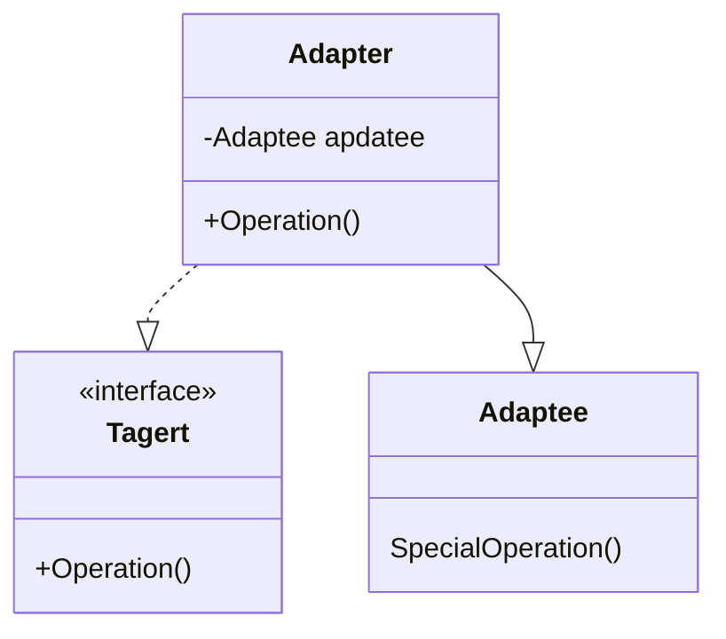
```mermaid!
classDiagram

class Tagert{
    <<interface>>
    +Operation()
}

class Adapter {
    -Adaptee apdatee
    +Operation()
}

class Adaptee {
    SpecialOperation()
}

Adapter ..|> Tagert
Adapter --|> Adaptee
```

golang 示例代码如下：
``` go
type Target interface {
    Operation()
}

type Adaptee struct {
}

func (a *Adaptee)SpecialOperation(){
}

type Adapter struct {
    Adaptee
}

func (a* Adapter)Operation(){
    a.SpecialOperation()
}

func Adaptee2Target() Target{
    return &Adapter{}
}
```
通过附加一层包装，来避免重复性的代码开发，这是非常常用的一种手段，但是也容易造成“层层包装”的现象，尤其是在使用子类多态的情况下。在`C/C++`中使用虚成员函数实现多态，在编译阶段无法确定确切调用的函数（静态联编），只有在运行时才能确认（动态联编），而这会增加调用的耗时。

### Bridge
桥模式：将抽象与其实现分离，从而允许两者独立变化。使用桥模式可是使得抽象和实现在运行时进行绑定选择。

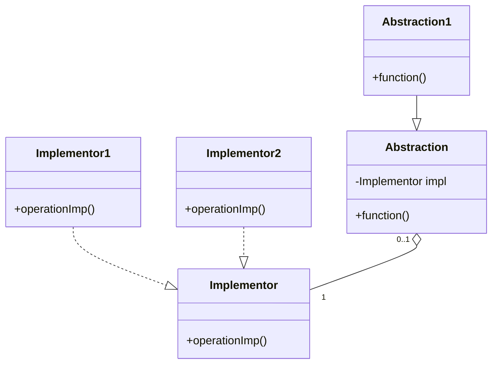
```mermaid!
classDiagram
class Abstraction{
    -Implementor impl
    +function()
}

class Implementor {
    +operationImp()
}

class Implementor1{
    +operationImp()
}

class Implementor2{
    +operationImp()
}

class Abstraction1{
    +function()
}

Abstraction1 --|> Abstraction
Implementor1 ..|> Implementor
Implementor2 ..|> Implementor
Abstraction "0..1" o-- "1" Implementor
```

golang 示例代码如下：
``` go
type Abstraction interface {
    Print()
}

type Implementor interface{
    OperationPrint(int)
}

type Implementor1 struct {
}

func (i1 *Implementor1)OperationPrint(x int){
    fmt.Printf("%d", x)
}

type Implementor2 struct {
}

func (i2 *Implementor2)OperationPrint(x int){
    fmt.Printf("%x", x)
}

type Abstraction1 struct{
    impl Implementor
    x int
}

func (a1 *Abstraction1)Print(){
    a1.impl.OperationPrint(a1.x)
}

func CreateAbstract(x int, impl Implementor) Abstraction{
    return &Abstraction1{
        x: x,
        impl: impl,
    }
}

// callers
CreateAbstract(1, &Implementor2{}).Print()
CreateAbstract(100, &Implementor1{}).Print()
```
由于 golang 不具备继承的语法特性，上面的示例看起来与`Adapter`模式有些类似，不过两者的侧重点不一样：`Adapter`侧重于不同接口之间的兼容，`Bridge`侧重于抽象和实现的分离。

golang 具有第一公民函数的特性，可以将上面的示例进行简化：
``` go
type Abstraction interface {
    Print()
}

type Abstraction1 struct{
    impl func(int)
    x int
}

func (a1 *Abstraction1)Print(){
    a1.impl(a1.x)
}

func CreateAbstract(x int, impl func(int)) Abstraction{
    return &Abstraction1{
        x: x,
        impl: impl,
    }
}

// callers
CreateAbstract(1, func(x int){fmt.Printf("%d", x)}).Print()
CreateAbstract(100, func(x int){fmt.Printf("%x", x)}).Print()
```
这是种比较偏`C/C++`的写法，虽然一定程度上破坏了抽象性，但是可以减少代码数量。

### Composite

组合模式，将多个对象以树结构组合，形成部分-整体的层次结构。组合模式可以使客户统一对待单个对象和对象集。

**使用场景**：调用方忽略部分和整体的细节，抽象出整体和部分操作的共性部分提供给调用方。

有两种组合模式：
+ 集合模式（Design for uniformly）
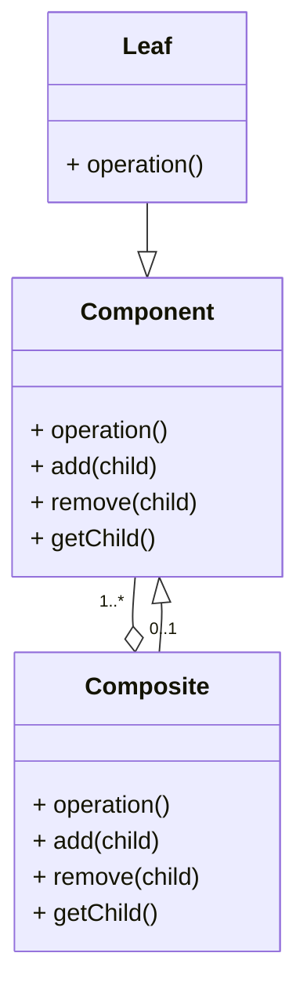
```mermaid!
classDiagram
class Component{
    + operation()
    + add(child)
    + remove(child)
    + getChild()
}

class Leaf{
    + operation()
}

class Composite{
    + operation()
    + add(child)
    + remove(child)
    + getChild()
}

Component "1..*" --o "0..1" Composite
Leaf --|> Component
Composite --|> Component

```

+ 类型安全模式(Design for Type Safety)

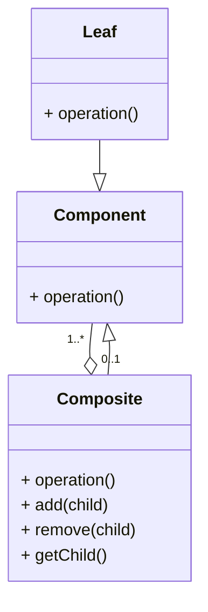
```mermaid!
classDiagram
class Component{
    + operation()
}

class Leaf{
    + operation()
}

class Composite{
    + operation()
    + add(child)
    + remove(child)
    + getChild()
}

Leaf --|> Component
Composite --|> Component
Component "1..*" --o "0..1" Composite
```

golang 示例代码如下：

``` go

type Component interface {
    Print()
}

type Leaf struct {
    name string
}

func (l *Leaf)Print(){
    fmt.Println(l.name)
}

func NewLeaf(name string) *Leaf{
    return &Leaf{name: name}
}

type Composite struct{
    childs []Component
}

func (c *Composite)Add(ch Component){
    c.childs = append(c.childs, ch)
}

func (c *Composite)Remove(ch Component){
    for i, c := range c.childs{
        if c == ch {
            c.childs = append(c.childs[:i], c.childs[i+1:]...)
            break
        }
    }
}

func (c *Composite)GetChild(index int) Component{
    if index < len(c.childs){
        return c.childs[index]
    }

    return nil
}

func (c *Composite)Print(){
    for _, c := range c.childs{
        c.Print()
    }
}

// callers
com := &Composite{}
com.Add(NewLeaf("leaf1"))
com.Add(NewLeaf("leaf2"))
com.Add(NewLeaf("leaf3"))


com1 := &Composite{}
com1.Add(com)
com1.Add(NewLeaf("leaf4"))
com1.Print()
com1.GetChild(1).Print()

// output:
// leaf1
// leaf2
// leaf3
// leaf4
// leaf4
```

上面的示例通过组合模式形成一个n叉树，调用根结点的`Print`方法就可以按照从左到右的顺序打印出所有叶子节点的`name`。

### Decorator
修饰器模式：动态地将附加的责任附加到对象上，以保持相同的接口。 装饰器为子类提供了灵活的替代方案，以扩展功能。
**使用场景**：在原有类成员函数的基础上，扩展功能并且不去修改该类，这样既可以维持存量调用方式不变，也能满足新需求。

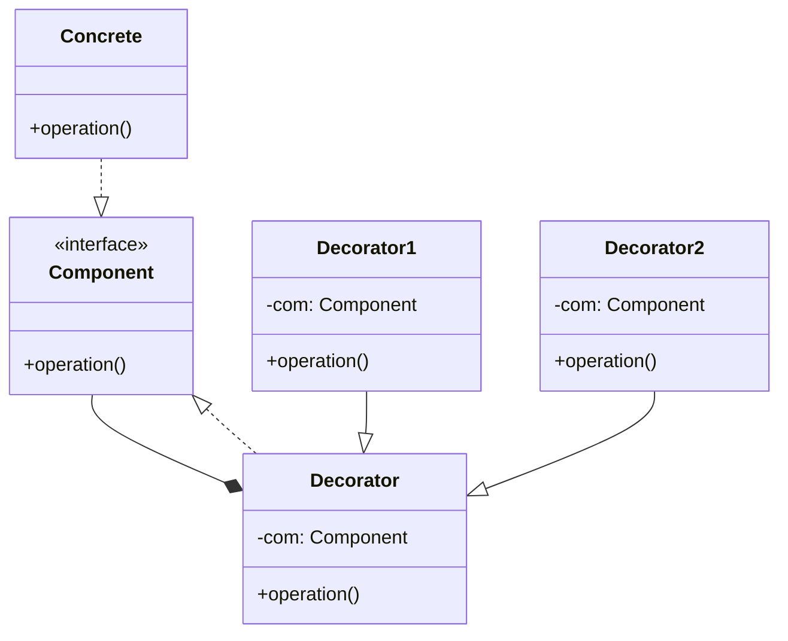
```mermaid!
classDiagram
class Component{
    <<interface>>
    +operation()
}

class Concrete{
    +operation()
}

class Decorator{
    -com: Component
    +operation()
}

class Decorator1 {
    -com: Component
    +operation()
}

class Decorator2 {
    -com: Component
    +operation()
}


Component --* Decorator
Concrete ..|> Component
Decorator ..|> Component
Decorator1 --|> Decorator
Decorator2 --|> Decorator
```

golang 示例代码如下：

``` go
type Component interface{
    Print()
}

type Concrete struct{
}

func (*Concrete)Print(){
    fmt.Println("concreate")
}

type Decorator struct{
   com Component
}

func (d *Decorator)Print(){
    d.com.Print()
    fmt.Println("decorator")
}

func NewDecorator(com Component)Decorator{

}

// callers
var com Component = NewDecorator(&Concrete{})
com.Print()
com = NewDecorator(com)
com.Print()

// output:
// concreate
// decorator
// concreate
// decorator
// decorator
```
以上的示例代码省去了继承的中间步骤，还可以像`Bridge`模式一样，利用`第一公民函数`和`闭包`特性继续简化如下：

``` go
func Decorator(print func())func(){
    return func(){
        print()
        fmt.Println("decorator")
    }
}

// callers
Decorator(func(){
    fmt.Println("concreate")
})()
// output:
// concreate
// decorator
```

### Extension object

### Facade
门面模式（外观模式）：把一组复杂的接口整合起来，形成几个简单的接口提供给调用方。使得调用放对子系统的依赖最小化、简单化。

**使用场景**：子系统的多个接口可以组成一个资源类供调用方使用。

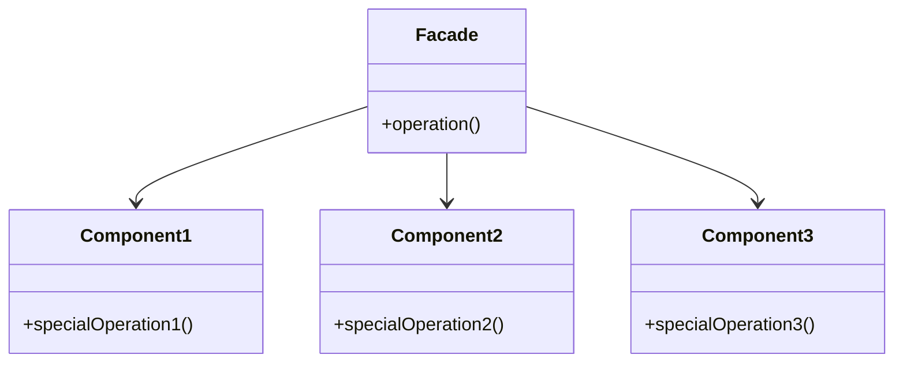
```mermaid!
classDiagram
class Facade{
    +operation()
}

class Component1{
    +specialOperation1()
}

class Component2{
    +specialOperation2()
}

class Component3{
    +specialOperation3()
}

Facade --> Component1
Facade --> Component2
Facade --> Component3

```

golang的示例代码如下：
``` go
type CPU struct{
}

func (*CPU)Freezy(){
    // TODO
}

func (*CPU)Jump(position uint64){
    // TODO
}

func (*CPU)Execute(){
    // TODO
}

type HardDrive struct{
}

func(hd *HardDrive)Read(lba uint64, size int) []byte{
    // TODO
}

type Memory struct{
}

func (Memory)Load(position uint64, data []byte){
    // TODO
}

type ComputerFacade struct {
    hd  HardDrive
    mem Memory
    cpu Cpu

    kBootAddress uint64
    kBootSector uint64
    kSectorSize int
}

func (cf *ComputerFacade)Start() {
    cf.cpu.Freezy()
    cf.mem.load(cf.kBootAddress, cf.hd(cf.kBootSector, cf.kSectorSize))
    cf.cpu.Jump(cf.kBootAddress)
    cf.cpu.Execute()
}

// caller
cf := ComputerFacade{}
cf.Start()
```
在上面的示例中模拟了电脑启动的过程，可以敏锐的发现`cpu`、`memory`、`hard drive` 都是电脑的有机组成部分，它们可以组成一个`computer`资源类供调用方使用。

### Flyweight
享元模式：多个调用方之间尽量共享依赖单元，从而减少内存的开销。
**使用场景**：在各类算法引擎中或着算法库（openssl）中非常常见，将可变的输入输出与不变的运算逻辑和参数抽离。

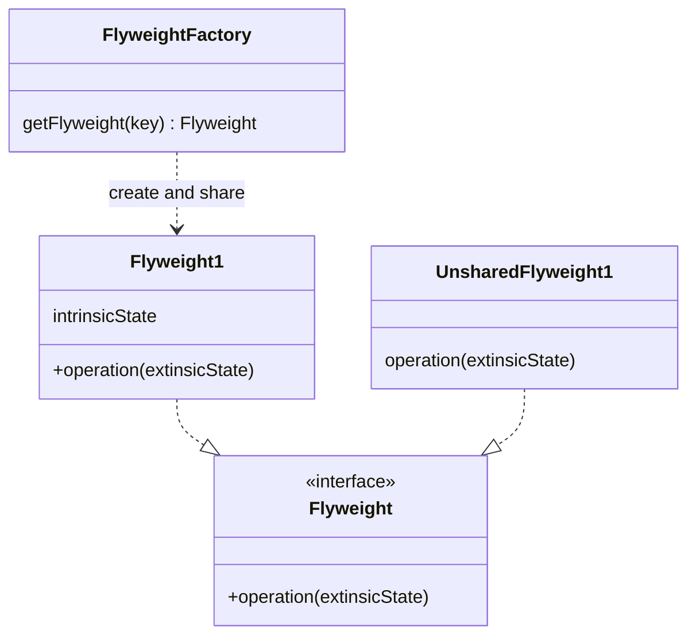
```mermaid!
classDiagram
class Flyweight{
    <<interface>>
    +operation(extinsicState)
}

class Flyweight1{
    intrinsicState
    +operation(extinsicState)
}

class UnsharedFlyweight1{
    operation(extinsicState)
}

class FlyweightFactory{
    getFlyweight(key)Flyweight
}

FlyweightFactory ..> Flyweight1 : create and share
Flyweight1 ..|>  Flyweight
UnsharedFlyweight1 ..|>  Flyweight
```

golang的示例代码如下：
``` go
type Color struct {
    red int
    blue int
    yellow int
}

func (c *Color)Set(red, blue, yellow int){
    c.red = red
    c.blue = blue
    c.yellow = yellow
}

type ColorPalette struct {
    colors map[string]Color
}

func (cp *ColorPalette)findByName(name string) *Color {
    c, ok := cp.colors[name]
    if ok {
        return c
    }

    return nil
}

func (cp *ColorPalette)addColor(name string, c *Color){
    cp.colors[name]=c
}

func (cp *ColorPalatte)Palatte(name string)*Color{
    c := cp.findByName(name)
    if c == nil{
        c = &Color{}
        cp.addColor(name, c)
    }

    return c
}

func NewColorPalette()*ColorPalette{
    cp := &ColorPalette{
        colors: map[string]Color{}
    }

    cp.addColor("red", &Color{red:255})
    cp.addColor("yellow", &Color{yellow:255})
    cp.addColor("blue", &Color{blue:255})
}

type Brush struct {
    color *Color
    palette *ColorPalette
}

func (b *Brush)Color(name string) {
    b.color = palette.findByName(name)
}

func (b* Brush) Draw(x, y, x1, y1 int){
    // TODO
}

func NewBrush(cp *ColorPalette) *Brush{
    return &Brush{
        palette: cp,
    }
}

// callers
palette := NewColorPalette()
brush := NewBrush(palette)
palette.Palatte("green").Set(0, 255, 255)
brush.Color("green")
brush.Draw(100,100,200,300)
```
上面以调色板为例，展示了享元模式的基本用法，享元模式的一个难点在于：共享单元的生命周期的管理。当调用方决定去释放该单元时，一定要保证该单元没有被其他地方占用。通常采用计数器的方式，被引用时计数加一，结束引用时计数减一，当计数为负时释放该单元。

计数器有两种方式，一种方式是与共享单元绑定，另一种方式是由管理共享单元的对象统计。
``` go
type Unit struct{
    factor int
}

func (*Unit)Caculate(x int)int{
    return x * factor
}

func (u *Unit)SetFactor(f int){
    u.factor = f
}

type counter struct {
    count int
}

func (c *counter)decr() int {
    c.count--
    return c.count
}

func (c *counter)incr() int {
    c.count++
    return c.count
}

type UnitEx struct {
    Unit
    counter
    name string
}

type UnitFactory struct{
    units map[string]*UnitEx
}

func (uf *UnitFactory)Release(u *UnitEx) {
    if u.decr() < 0 {
        // TODO: release unit
    }
}

func (uf *UnitFactory)Delete(name string){
    u, ok := uf.units[u.name]
    if ok {
        delete(uf.units, u.name)
        uf.Release(u)
    }
}

func (uf *UnitFactory)ADD(name string, factor int){
    u := &UnitEx{name:name}
    u.SetFactor(factor)
    uf.units[name] = u
}

func (uf *UnitFactory)Get(name string) *UnitEx {
    u, ok := uf.units[name]
    if ok {
        u.incr()
    }

    return u
}

// callers
// init unit
unitFactory.ADD("first", 10)

// use unit
u := unitFactory.Get("first") // count = 1
if u != nil{
    u.Caculate(10) // return 100
    unitFactory.Release(u) // count = 0
}

// delete unit
unitFactory.Delete("first") // count = -1, delete unit from sets.
```

上面的示例就是第一种方案，把计数器与共享单元绑定。任何调用方用`Get()`获取到共享单元后，都不会因为`Delete()`导致资源不可用，只要保证对应的`Release()`会被调用，也不会出现资源泄漏的问题。

实际上面的示例并不需要计数器，因为`golang`中有`gc`机制，当`UnitEx`对象没有被引用的时候会自动被回收掉。主要是预防在`Relese()`阶段有主动释资源放动作（如：关闭socket、关闭 channel等）的情况，由于`gc`并非实时具有一定延迟，可能会因为资源短时间大量泄漏（如：积累特别多client socket）导致不可用，所以这种资源保护还是有一定必要的。

### Front controller

### Marker

### Module

### Proxy
代理模式：为另一个对象提供代理或占位符，以控制对其的访问。
**使用场景**：对某个对象的访问需要是可控制的，在访问时要执行一些附加的动作。
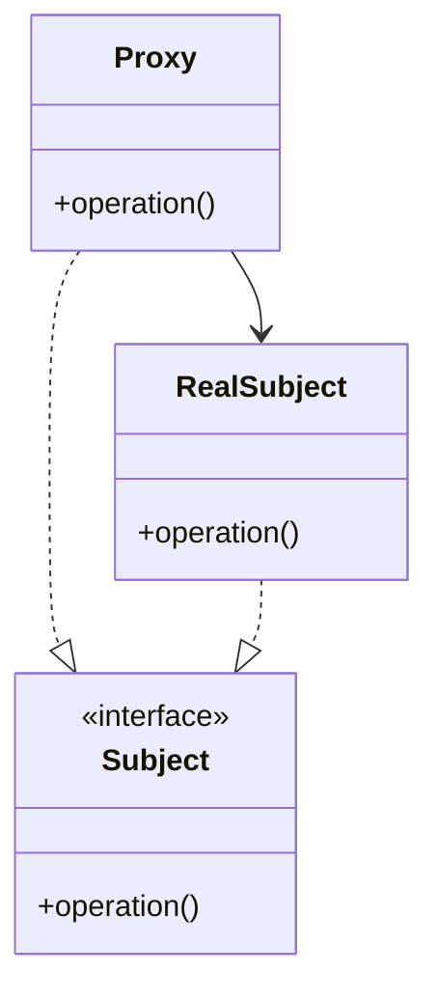
```mermaid!
classDiagram

class Subject{
    <<interface>>
    +operation()
}

class Proxy{
    +operation()
}

class RealSubject{
    +operation()
}

Proxy ..|> Subject
RealSubject ..|> Subject
Proxy --> RealSubject
```

golang示例代码如下：

``` go
type ICar interface {
    DriveCar()
}

type Car struct {
}

func ( *Car)DriveCar(){
    fmt.Println("running ....!!!")
}

type ProxyCar struct {
    driverAge int
    realCar Car
}

func (p *ProxyCar)DriveCar(){
    if p.driverAge < 16 {
        fmt.Println("Sorry, the driver is too young to drive.")
    }else{
        p.realCar.DriveCar()
    }
}
```
以上示例与`Decorator`模式相似，不过两者的侧重点不同，`Proxy`模式侧重于访问控制，而`Decorator`测重于功能的拓展。

### Twin

## Behavioural patterns

### Blackboard

### Chain-of-responsibility
链式应答模式：通过给一个以上的对象一个处理请求的机会，避免将请求的发送者耦合到其接收者。 链接接收对象，并沿着链传递请求，直到对象处理该请求为止。

**使用场景**：一个request需要对应多个应答方，且各个应答方的判断条件不一致。

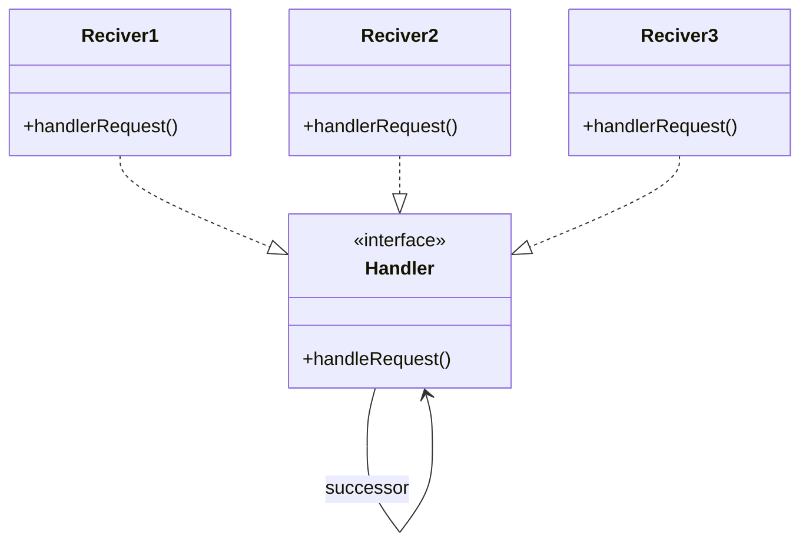
```mermaid!
classDiagram

class Handler{
    <<interface>>
    +handleRequest()
}

class Reciver1{
    +handlerRequest()
}

class Reciver2{
    +handlerRequest()
}

class Reciver3{
    +handlerRequest()
}

Reciver1 ..|> Handler
Reciver2 ..|> Handler
Reciver3 ..|> Handler
Handler --> Handler : successor
```

golang 示例代码如下：
``` go

type DebugLevel int
const (
    panic DebugLevel = 1 << itoa
    error
    warning
    info 
    debug 
    function_error
    function_msg
    all = 1023
)

type Logger interface {
    Write(DebugLevel, string)
}

type ConsoleLogger struct{
    next Logger
    mask DebugLevel
}

func (cl *ConsoleLogger)Write(level DebugLevel, msg string){
    if cl.mask & level {
        fmt.Println("Console: ", msg)
    }

    if cl.next != nil {
        cl.next.Write(level, msg)
    }
}

func NewConsoleLogger(next Logger) Logger{
    return &ConsoleLogger{
        next: next,
        mask: all,
    }
}

type FileLogger struct{
    next Logger
    mask DebugLevel
}

func (fl *FileLogger)Write(level DebugLevel, msg string){
    if fl.mask & level {
        fmt.Println("File: ", msg)
    }

    if fl.next != nil {
        fl.next.Write(level, msg)
    }
}

func NewFileLogger(next Logger) Logger{
    return &FileLogger{
        next: next,
        mask: all^debug,
    }
}

type EmailLogger struct {
    next Logger
    mask DebugLevel
}

func (el *EmailLogger)Write(level DebugLevel, msg string){
    if el.mask & level {
        fmt.Println("Email: ", msg)
    }

    if el.next != nil {
        el.next.Write(level, msg)
    }
}

func NewEmailLogger(next Logger) Logger{
    return &EmailLogger{
        next: next,
        mask:function_error| function_msg,
    }
}

// callers
logger := NewEmailLogger(nil)
logger = NewFileLogger(logger)
logger = NewConsoleLogger(logger)

logger.Write(debug, "debug message")
logger.Write(info, "info message")
logger.Write(function_msg, "function message")

// output:
// Console: debug message
// Console: info message
// File: info message
// Console: function message
// File: function message
// Email: function message
```
以上的示例中把多个输出`logger`组成一个`loggers chain`，可以由调用方自由组合，又避免了发送方和接收方耦合。以上的写法和`Composite`模式有些类似，但并非层级关系，而且每个节点都会对`request`进行判断和处理，并非单纯的转发。

### Command
命令模式：将请求封装为对象，从而可以对具有不同请求的客户端进行参数化，以及对请求进行排队或记录。 它还允许支持不可撤消的操作。

**使用场景**：

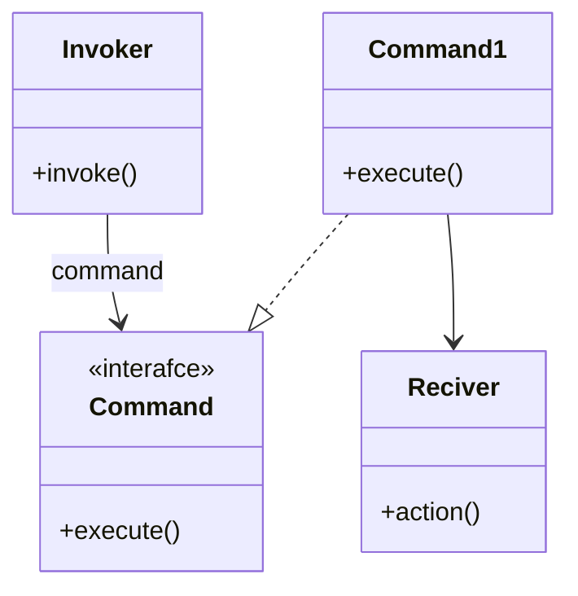
```mermaid!
classDiagram
class Invoker{
    +invoke()
}

class Command{
    <<interafce>>
    +execute()
}

class Command1{
    +execute()
}

class Reciver{
    +action()
}

Invoker --> Command: command
Command1 ..|> Command
Command1 --> Reciver
```

golang 示例代码如下：
``` go
type ForceUnit interface {
    Attack()
    Defense()
}

type solider struct {
}

func (*solider)Attack(){
}

func (*solider)Defense(){
}

func NewSolider() *solider {
    return &solider{}
}

type ICommand interface{
    Execute()
}

type AttackCommand struct {
    f ForceUnit
}

func (ac *AttackCommand)Execute(){
    ac.f.Attack()
}

func CreateAttackCommand(f ForceUnit) *AttackCommand{
    return &AttackCommand{f:f}
}

type DefenseCommand struct{
    f ForceUnit
}

func (dc *DefenseCommand)Execute(){
    dc.f.Defense()
}

func CreateDefenceCommand(f ForceUnit) *DefenseCommand{
    return &AttackCommand{f:f}
}

type Invoker struct{
    startCmd ICommand
    stopCmd ICommand
}

func (i *Invoker)Start(){
    i.startCmd.Execute()
}

func (i *Invoker)Stop(){
    i.stopCmd.Execute()
}

func NewInvoker(startCmd, stopCmd ICommand) *Invoker{
    return &Invoker{startCmd:startCmd, stopCmd:stopCmd}
}

// callers
s := NewSolider()
invoker := NewInvoker(CreateAttackCommand(s),CreateDefenceCommand(s))
invoker.Start() // solider start attacking.
invoker.Stop() // solider start defensing.
```

上面的示例是通过一个`invoker`去控制一个`solider`去`attack`或`defense`，多层的嵌套显得有些冗余。关键在于`invoker`这一层可以适应任何`start`和 `stop`二元模式的`command group`。开始的不仅仅可以是`attack command`也可以是`building command`，这样可以制定一系列的组合在一个“游戏回合”内执行。

### Interpreter
解释器模式：给定一种语言并定义其语法的表示形式，使用该表示形式来解释该语言中的句子。

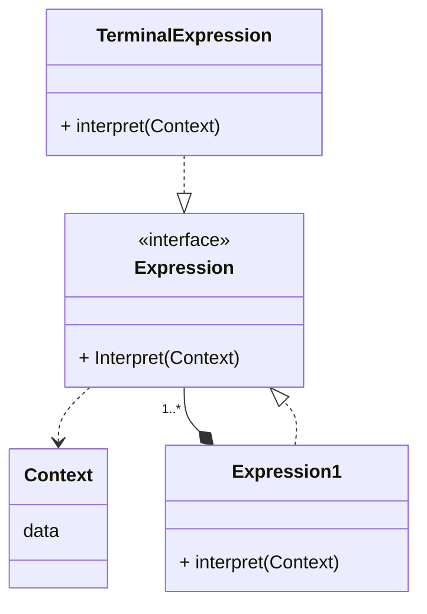
```mermaid!
classDiagram

class Context{
    data
}

class Expression{
    <<interface>> 
    + Interpret(Context)
}

class TerminalExpression {
    + interpret(Context)
}

class Expression1 {
    + interpret(Context)
}

Expression ..> Context
Expression1 ..|> Expression
TerminalExpression ..|> Expression
Expression "1..*" --* Expression1
```

golang 的示例如下：

``` go

```

### Iterator
遍历器模式：在不了解一个聚合对象的底层实现情况下，顺序遍历其中所有元素。
**使用场景**：遍历数组、Map、链表等。

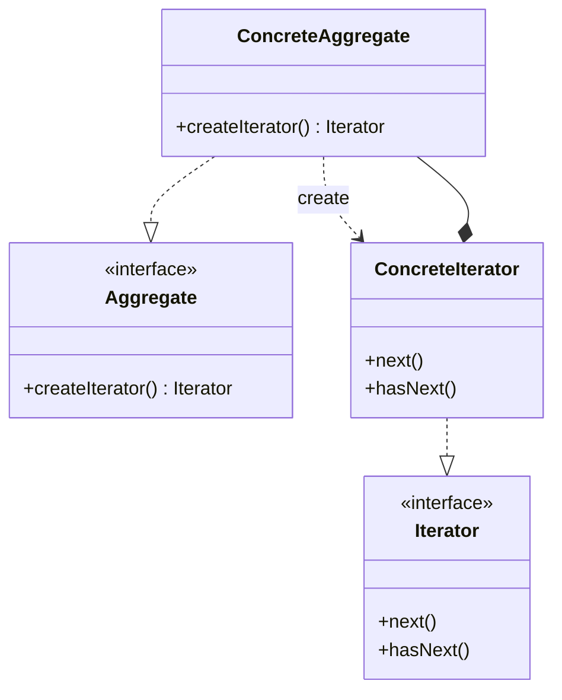
```mermaid!
classDiagram

class Iterator{
    <<interface>>
    +next()
    +hasNext()
}

class Aggregate {
    <<interface>>
    +createIterator() Iterator
}

class ConcreteAggregate{
    +createIterator() Iterator
}

class ConcreteIterator{
    +next()
    +hasNext()
}

ConcreteAggregate ..|> Aggregate
ConcreteIterator ..|> Iterator
ConcreteAggregate ..> ConcreteIterator: create
ConcreteIterator *-- ConcreteAggregate
```

golang的示例代码如下：
``` go
type Iterator interface {
    Next() interface{}
    HasNext() bool
}

type Repository interface {
    Iterator() Iterator
}

type ConceteRepository struct {
    elements []interface{}
}

func (cr * ConceteRepository)Iterator()Iterator{
    iter := &ConceteIterator{}
    // copy elements
    iter.cr.elements = append(iter.cr.elements, cr.elements...)
} 

type ConceteIterator struct {
    index int
    end int
    cr ConceteRepository
}

func (ci *ConceteIterator)HasNext() bool{
    return index < end
}

func (ci *ConceteIterator)Next()interface{} {
    if ci.HasNext() {
        defer ci.index++
        return cr.elements[ci.index]
    }
    
    return nil
}

// callers
for iter := repository.Iterator() ; iter.HasNext(); {
    fmt.Printf("%#v", iter.Next())
}
```

以上的示例代码是展示了一个简单的遍历对象内数组元素的过程，在实现过程中有一点需要注意：拷贝 `elements` 数组而不是直接的引用，对当时的状态做一个快照。

遍历模式在`C++`的 `std`库中是十分关键的模式，在`golang`中的一些`database driver`包中也十分常见，主要用途是遍历查询的结果。

### Mediator 
中介者模式：定义一个对象，该对象封装了一组对象之间的交互方式。中介类通过阻止对象之间显式地相互引用来促进松散耦合，并且它允许它们的交互独立地变化。

**使用场景**：两个具体类之间可能发生互相引用的情况，例如：用户要通过邮箱发邮件，邮箱要把邮件投递给每个用户。

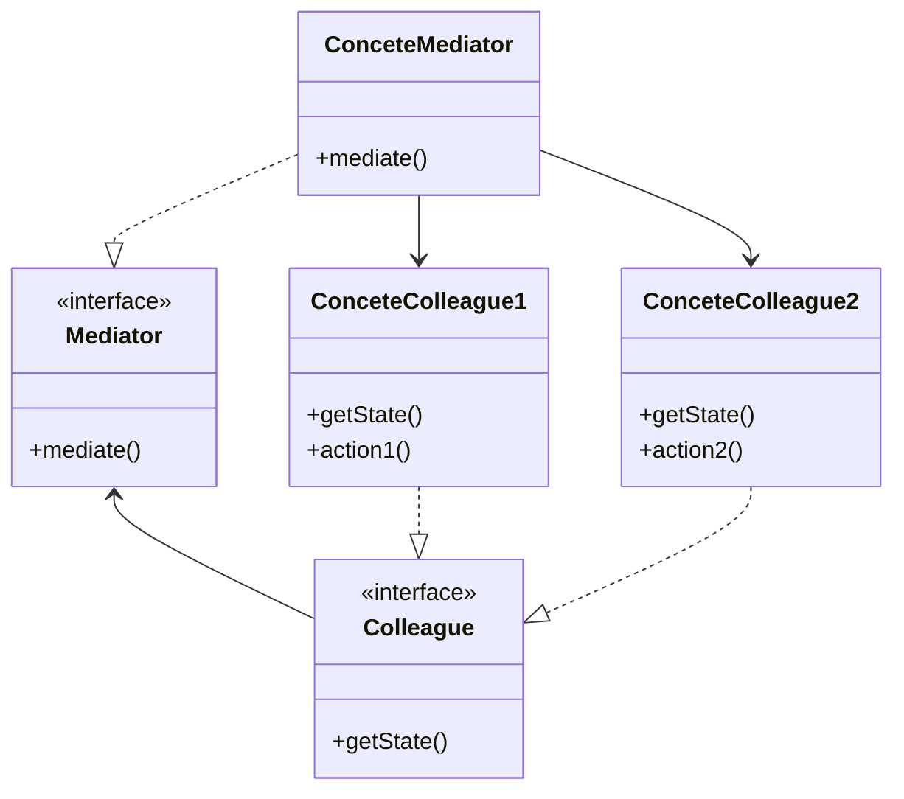
```mermaid!
classDiagram
class Mediator{
    <<interface>>
    +mediate()
}

class Colleague{
    <<interface>>
    +getState()
}

class ConceteMediator {
    +mediate()
}

class ConceteColleague1 {
    +getState()
    +action1()
}

class ConceteColleague2 {
    +getState()
    +action2()
}

Mediator <-- Colleague
ConceteMediator --> ConceteColleague1
ConceteColleague1 ..|> Colleague
ConceteMediator --> ConceteColleague2
ConceteColleague2 ..|> Colleague
ConceteMediator ..|> Mediator
```

golang 示例代码如下：
``` go

type Email struct {
    From string
    To string
    Message string
}

type Mediator interface{
    SendMessage(from, to, message string)
    ReceiveMessage(from, to, message string)
}

type User struct {
    md Mediator
    name string
}

func NewUser(name string, md *ConceteMediator) *User{
    user := &{name:name, md:md}
    md.addUser(user)
    return user
}

func (u *User) Name() string {
    return u.name
}

func (u *user)Receive(sender, message string){
    if sender != u.name {
        fmt.Printf("from %s to %s: %s", sender, name, message)
    } 
}

func (u *user)Send(rc, message string){
    u.md.SendMessage(u.name, rc, message)
}

type EMailBox struct {
    md Mediator
}

func NewEmailBox(md *ConceteMediator)*EMailBox{
    eb := &EMailBox{
        md : md
    }

    md.setEmailBox(eb)
    return md
}

func (eb *EMailBox)push(email Email){
    // TODO
}

func (eb *EMailBox)pop()Email{
    // TODO
}

func (eb *EMailBox)number() int {
    // TODO
}

func (eb *EMailBox)HasFree() bool {
    // TODO
}

func (eb *EMailBox)Delivery(){
    for eb.number() > 0 {
        email := eb.pop() 
        md.ReceiveMessage(email.from, email.to, email.message)
    }
}

type ConceteMediator struct {
    emailBox *EMailBox
    receivers map[string]*User
}

func (m *ConceteMediator)setEmailBox(eb *EMailBox){
    m.emailBox = eb
    eb.md = m
}

func (m *ConceteMediator)addUser(user *User){
    m.receivers[user.Name()] = user
    user.md = m
}


func (m *ConceteMediator)SendMessage(from, to, message string){
   sender := user.Name()
   if m.emialBox.HasFree() {
       m.emialBox.push(Email{From: from, To: to, Message: message})
   }
}

func (m *ConceteMediator)ReceiveMessage(from, to, message string){
        rc, ok := m.receivers[to]
        if ok {
            rc.Receive(from, message)
        }
    }
}

// callers
emailBox := NewEmailBox(mediator)
alice := NewUser("alice", mediator)
bob := NewUser("bob", mediator)

alice.Send("bob", "nice to meet you.")
emailBox.Delivery()

// output:
// from alice to bob: nice to meet you.
```
上面的示例展示了邮箱发送邮件的过程，用户把邮件通过`Mediator`放到邮箱中，邮箱在通过`Mediator` 投递到每个用户。如果不添加`Mediator`类，则会出现`User` 和`EmailBox`互相调用的情况，导致强耦合。

### Memento
备忘录模式：在不打破对象封装的情况下，备份对象的状态，帮助对象回滚到前一状态。
**使用模式**：对于需要版本记录的对象，适用于备忘录模式。例如：执行了一个错误的提交，需要回滚到前一个版本。

```mermaid!
classDiagram
class Originator{
    - state
    + createMemento() 
    + restoreMemento(memento)
}

class Memento {
    - state
    + getState()
    + setState()
}

Originator ..> Memento: <<create>>
Originator --> Memento
```

golang的示例代码如下：
``` go
type Memento struct{
    state int
}

func (m *Memento)setState(state int){
    m.state = state
}

func (m *Memento)getState() int {
    return m.state
}

type EWallet struct{
    balance int
}

func NewEWallet(balance int)*EWallet{
    return &EWallet{balance: balance}
}

func (ew *EWallet)CreateMemento() *Memento{
    m := new(Memento)
    m.setState(ew.balance)
    return m
}

func (ew *EWallet)RestoreMemento(m *Memento){
    ew.balance = m.getState()
}

func (ew *EWallet)Pay(pay int){
    ew.balance -= pay
}

// callers
ewallet := NewEWallet(100)
mem := ewallet.CreateMemento()

ewallet.Pay(10) // 90
ewallet.RestoreMemento(mem) // back to 100
```
对于开发人员来讲，每一个函数的调用，都是一次状态的流转。对状态进行备份，当触发回滚时再恢复状态，此时就需要用到`Memento`模式。

### observer
观察者模式：定义对象之间的一对多依赖关系，其中一个对象的状态变化导致其所有依赖关系都被通知并自动更新。

```mermaid!
classDiagram
class observer {
    <<interface>>
    +update()
}

class subject {
    +attech(observer)
    +dettech(observer)
    +notify()
}

class conteteObserver1{
    +update()
}

class conteteObserver2{
    +update()
}

subject --> observer : obeservers
conteteObserver1 ..|> observer
conteteObserver2 ..|> observer

```

golang 示例代码如下：
``` go
type Observer interface{
    Update()
}

type conteteObserver struct{
    state int
}

func (co *conteteObserver)Update(){
    fmt.Println("Check if receive pay.")
}

func NewObserver() Observer{
    return &conteteObserver{}
}

type subject struct {
   obs map[observer]struct{}
}

func (s *subject)Attech(o observer){
    s.obs[o] = struct{}
}

func (s *subject)Dettech(o observer){
    delete(s.obs, o)
}

func (s *subject)Notify(){
    for o := range s.obs {
        o.Update()
    }
}

type Wallet struct {
    sub subject
    balance int
}

func (w *Wallet)Pay(pay int){
    if w.balance >= pay {
        w.balance -= pay
        w.sub.Notify()
    }
}

func (w *Wallet)PaySubject() *subject{
    return &w.sub
}

// callers
wallet.PaySubject().Attech(NewObserver())
wallet.Pay(1)
// output:
// Check if receive pay.
```

上面给出了一个检测转账事件的示例，`Wallet`类直接关联到`Subject`是有些强耦合性的，可以利用`Mediator`模式、`Flywegiht`模式或`Singelton`模式进行事件转发。
这里需要注意的是，观察者模式是GoF提到的23种模式的一种，只是一个基本概念。并没有解决如下问题：1.消除对观察到变化主题的兴趣；2.在通知观察者之前或之后，对被观察到的主题进行特殊的逻辑处理。

该模式不记录通知发送，也不保证观察者已收到更改。这些问题通常在消息队列系统中处理，观察者模式是消息队列系统中的一小部分。`publish-subscribe`是一种消息模式，而不是一种设计模式，两者不要混淆。

### state
状态模式：当对象的内部状态更改时，允许其更改其行为。该对象似乎将更改其类。

**使用场景**：对象内部包含一个有限状态机时，不同的状态对应不同处理类。

```mermaid!
classDiagram
class Context{
    -state State
    +Request() 
}

class State{
    <<interface>>
    +Handle()
}

class ConceteStateA{
    +Handle()
}

class ConceteStateB{
    +Handle()
}

State --* Context : state.Handle()
State <|.. ConceteStateA
State <|.. ConceteStateB

``` 

golang的示例代码如下：
``` go
type State interface{
    Check(num int) bool
}

type normalState struct{
}

func (normalState)Check(num int) bool {
    // TODO
}

type wariningState struct {
}

func (wariningState)Check(num int) bool {
    // TODO
}

type panicState struct{
}

func (panicState)Check(num int) bool {
    // TODO
}

type recoverState struct{
}

func (recoverState)Check(num int) bool {
    // TODO
}

type Context struct {
    state State
}

func (c *Context)Request(num int) {
    if !c.state.Check(num) {
        return
    }

    // TODO
}

func (c *Context)SwitchState(state State){
    c.state = state
}

// callers
// normal
context.Request(10086)

// warning
context.SwitchState(wariningState)
context.Request(10086)

// recover
context.SwitchState(recoverState)
context.Request(10086)
```

状态模式可以将状态切换和处理逻辑分割开，在包含多个状态的流程中可以降低代码的复杂度，增加可读性。需要注意的是，状态切换动作尽量不要放在逻辑处理单元中来执行，这样会增加耦合性，也不利于代码维护。

### Strategy

策略模式：定义一系列算法，封装每个算法，并使它们可互换。 策略使算法可以独立于使用该算法的客户端而变化。

```mermaid!
classDiagram
class Context{
    -strategy Strategy
    +Request() 
}

class Strategy{
    <<interface>>
    +Excute()
}

class ConceteStrategyA{
    +Excute()
}

class ConceteStrategyB{
    +Excute()
}

Strategy --* Context : state.Handle()
Strategy <|.. ConceteStrategyA
Strategy <|.. ConceteStrategyB
```

golang的示例代码如下：
``` go
struct Price interface {
    GetActPrice(float, int) float
}

struct discountedPrice struct {
}

func (discountedPrice) GetActPrice(rawPrice float, num int) float{
    sum := rawPrice * float(num)
    switch(num){
        case 1:
            sum *= 0.95
        case 2:
            sum *= 0.85
        default:
            sum *= 0.75
    }

    return sum
}

struct normalPrice struct {
}

func (normalPrice) GetActPrice(rawPrice float, num int) float{
    return rawPrice*float(num)
}

type CustomerBill struct {
    price Price
    bills []float
}

func (c *CustomerBill)Add(rawPrice float, num int){
    c.bills = append(c.bills, price.GetActPrice(rawPrice, num))
}

func (c *CustomerBill)Set(price Price){
    c.price = price
}

// callers

// start discounting
customerBill.Set(discountedPrice)
customerBill.Add(10, 4) // 40 * 0.75
customerBill.Add(300, 1) // 300 * 0.95
customerBill.Add(50, 2) // 50 *2 * 0.85 

// stop discounting
customerBill.Set(normalPrice)
customerBill.Add(50, 2) // 50 *2 
```

上面的类图和示例都与`State`模式十分相似，但是两者有一个最显著的不同：触发切换时机，`State`模式的切换是由处理逻辑触发的（根据其返回结果，或者直接在处理逻辑单元中执行状态切换），而`Strategy`的切换与逻辑单元无关。

### Template 
模板模式：在操作中定义算法的框架，将某些步骤推迟到子类。 模板方法允许子类重新定义算法的某些步骤，而无需更改算法的结构。

**使用场景**：在一些上层的逻辑流程框架相同，但底层处理函数有细微差别的情况下。

```mermaid!
classDiagram

class Algorithm{
    + primitive1()
    + primitive2()
    + primitive3()
    + run()
}

class ContectAlgorithm1{
    + primitive1()
    + primitive2()
    + primitive3()
    + run()
}

ContectAlgorithm1 --|> Algorithm
Algorithm --> Algorithm: run(){ this->primitive1() ... }
```

``` golang
type Primitive interface {
    primitive1()
    primitive2()
}

type Template interface {
    Primitive
    Run()
}

type templateBase struct{
    p Primitive
}

func (t *templateBase)Run(){
    t.p.primitive1()
    t.p.primitive2()
}

type template1 struct {
    templateBase
}

func (*template1)primitive1(){
    fmt.Println("primitive1")
}

func (*template1)primitive2(){
    fmt.Println("primitive2")
}

func NewTemplate()Template{
    t1 := &template1{}
    t1.p = t1
    return t1
}

// callers
t := NewTemplate()
t.Run()

// output:
// primitive1
// primitive2
```
上面的示例中模仿了继承基类的过程，由于`golang`没有虚函数特性，只能把底层函数抽象为接口`Primitive`，在*基础模板*中调用。在具体实现类中包含*基础模板*，同时实现`Primitive`接口，再将具体实现类的对象赋值给*基础模板*引用。

### vistor
访客模式：表示要在对象结构的元素上执行的操作。访客可以定义新操作，而无需更改其所操作元素的类。

**使用模式**：这种模式在需要访问多个类型状态，又不想打破被访问对象结构的情况下使用很是方便。

```mermaid!
classDiagram
class Element{
    <<interface>>
    +accept(vistor)
}

class Element1 {
    +accept(vistor)
}

class Element2{
    +accept(vistor)
}

class vistor{
    <<interface>>
    +vistElement1(Element1)
    +vistElement2(Element2)
}

class conteteVistor{
    +vistElement1(Element1)
    +vistElement2(Element2)
}

conteteVistor ..|> vistor
vistor ..>  Element2
vistor ..>  Element1
Element1 ..|> Element
Element2 ..|> Element
Element ..> vistor
```
golang 示例代码如下：
``` go
type vistor interface{
    VistCar(*Car)
    VistDriver(*Driver)
}

type element interface{
    Accept(vistor)
}

type Car struct{
}

func (c *Car)Accept(vistor){
    vistor.VistCar(c)
}

type Driver struct{
}

func (d *Driver)Accept(vistor){
    vistor.VistDriver(d)
}
```
上面的示例代码展示了`vistor`模式的简单应用。

## Concurrency Pattern

### Active Object
主动对象模式：使方法执行与驻留在其自己的控制线程中的方法调用脱钩。 目标是通过使用异步方法调用和用于处理请求的调度程序来引入并发。

主动对象模式的实现多种多样，常见的实现方式如下：

``` go
package main

import (
	"fmt"
	"time"
	"sync"
	"runtime"
	"context"
)

type Runnable func()

type ActiveObject struct {
	list   chan Runnable
	ctx    context.Context
	cancel context.CancelFunc
}

func (a *ActiveObject) Run(r Runnable) {
	a.list <- r
}

func (a *ActiveObject) worker() {
	for running := true; running; {
		select {
		case <-a.ctx.Done():
			running = false
		case r, ok := <-a.list:
			if ok {
				r()
			} else {
				running = false
			}
		}
	}

	return
}

func (a *ActiveObject) Stop() {
	a.cancel()
	close(a.list)
}

func CreateActiveObject(ctx context.Context) *ActiveObject {
	a := ActiveObject{}
	a.ctx, a.cancel = context.WithCancel(ctx)
	a.list = make(chan Runnable, 1024)
	for i := 0; i < runtime.NumCPU(); i++ {
		go a.worker()
	}
	return &a
}

// callers
var obj = CreateActiveObject(context.TODO())

func useActive(r Runnable, n int) {
	for i := 0; i < n; i++ {
		obj.Run(r)
	}
}

func unUseActive(r Runnable, n int) {
	for i := 0; i < n; i++ {
		go r()
	}
}

func main() {
	n := 1024*1024*10
	wg := sync.WaitGroup{}
	wg.Add(n)
	
	start := time.Now().UnixNano()
	// useActive(func() {
	unUseActive(func() {
		j := 0
		for i := 0; i < 1024; i++ {
			j = j*i
		} 
		wg.Done()
	}, n)

	wg.Wait()
	start = time.Now().UnixNano() - start
	fmt.Println(start)
}

```
如上面的示例所示，启动了多个worker routines 监听 `list channel` 等待 `Runnable` 下发。goroutines 的 `GMP` 调度器类似上述的active模式，`runnable` 和 `worker` 对应 `goroutine` 和 `thread`，只是缺少了`processors`这一层，也是golang调度器模型中最复杂的一层。那在 golang中基于`goroutine`创建并发调度模型是否有意义？

下面对比下使用主动对象模式和不使用对象模式的效率：

|NUM|使用active pattern(ns)| 不使用active pattern(ns)|
|--|--|--|
|1|4873583000|3095207000|
|2|4909422000|3160784000|
|3|5156796000|3034738000|
|4|5206848000|3373471000|
|5|4918898000|3279373000|

上面的结果显而易见，使用`goroutines pool`的并发模型比使用原生的`GMP`模型总耗时要多40%，在golang中使用并发模型似乎并不能提高效率？

上面的测试代码中使用了“乘法+加法”的纯cpu运算，以此为基准调整一下单个`Runnable`的计算量：
``` go
func main() {
	n := 1024*1024*10
	wg := sync.WaitGroup{}
	wg.Add(n)
	
	start := time.Now().UnixNano()
	useActive(func() {
	// unUseActive(func() {
		j := 0
		for i := 0; i < 1024*100; i++ {
			j = j*i
		} 
		wg.Done()
	}, n)

	wg.Wait()
	start = time.Now().UnixNano() - start
	fmt.Println(start)
}
```
再次执行测试对比：

|NUM|使用active pattern(ns)| 不使用active pattern(ns)|
|--|--|--|
|1|36332021000|40188496000|
|2|37933490000|43609256000|
|3|34902684000|44315337000|
|4|35616489000|37804656000|
|5|35273675000|42551568000|

在计算量提高了`10`倍之后，运行测试的主机cpu跑満后，使用`goroutines pool`要优于原生的`GMP`。

具体的内部耗时可以用golang原生的profile去分析一下，首先我们在代码里加入可以生成`cpu profile` 的代码：
``` go
func main() {
    n := 1024 * 1024 * 10
    wg := sync.WaitGroup{}
    wg.Add(n)

    start := time.Now().UnixNano()

    if enable := true; enable {
        w, err := os.OpenFile("parrel.pprof", os.O_CREATE|os.O_RDWR, 0600)
        if err != nil {
            panic(err)
        }
        defer w.Close()

        pprof.StartCPUProfile(w)
        defer pprof.StopCPUProfile()
    }

    useActive(func() {
        // unUseActive(func() {
        j := 0
        for i := 0; i < 1024*100; i++ {
            j = j * i
        }
        wg.Done()
    }, n)

    wg.Wait()
    start = time.Now().UnixNano() - start
    fmt.Println(start)
}
```
针对两种情况进行`cpu profile`分析，首先来看使用了`goroutines pool`的：

```
ype: cpu
Time: Jun 15, 2021 at 8:07pm (CST)
Duration: 38.02s, Total samples = 7.19mins (1134.18%)
Entering interactive mode (type "help" for commands, "o" for options)
(pprof) top 10
Showing nodes accounting for 426.48s, 98.91% of 431.18s total
Dropped 88 nodes (cum <= 2.16s)
Showing top 10 nodes out of 21
      flat  flat%   sum%        cum   cum%
   329.75s 76.48% 76.48%    352.28s 81.70%  main.main.func1
    67.35s 15.62% 92.10%     67.35s 15.62%  runtime.usleep
    21.81s  5.06% 97.15%     21.81s  5.06%  runtime.asyncPreempt
     3.41s  0.79% 97.95%      3.41s  0.79%  runtime.pthread_cond_wait
     2.94s  0.68% 98.63%    372.65s 86.43%  main.(*ActiveObject).worker
     0.40s 0.093% 98.72%     15.27s  3.54%  runtime.lock2
     0.38s 0.088% 98.81%     17.27s  4.01%  runtime.selectgo
     0.26s  0.06% 98.87%     15.38s  3.57%  runtime.sellock
     0.10s 0.023% 98.89%     56.95s 13.21%  runtime.findrunnable
     0.08s 0.019% 98.91%     53.27s 12.35%  runtime.runqgrab
(pprof) tree
Showing nodes accounting for 426.53s, 98.92% of 431.18s total
Dropped 88 nodes (cum <= 2.16s)
----------------------------------------------------------+-------------
      flat  flat%   sum%        cum   cum%   calls calls% + context              
----------------------------------------------------------+-------------
                                           352.28s   100% |   main.(*ActiveObject).worker
   329.75s 76.48% 76.48%    352.28s 81.70%                | main.main.func1
                                            21.81s  6.19% |   runtime.asyncPreempt
----------------------------------------------------------+-------------
                                            53.19s 78.98% |   runtime.runqgrab
                                            14.16s 21.02% |   runtime.osyield
    67.35s 15.62% 92.10%     67.35s 15.62%                | runtime.usleep
----------------------------------------------------------+-------------
                                            21.81s   100% |   main.main.func1
    21.81s  5.06% 97.15%     21.81s  5.06%                | runtime.asyncPreempt
----------------------------------------------------------+-------------
                                             3.41s   100% |   runtime.semasleep
     3.41s  0.79% 97.95%      3.41s  0.79%                | runtime.pthread_cond_wait
----------------------------------------------------------+-------------
     2.94s  0.68% 98.63%    372.65s 86.43%                | main.(*ActiveObject).worker
                                           352.28s 94.53% |   main.main.func1
                                            17.27s  4.63% |   runtime.selectgo
----------------------------------------------------------+-------------
                                            15.27s   100% |   runtime.lockWithRank
     0.40s 0.093% 98.72%     15.27s  3.54%                | runtime.lock2
                                            14.16s 92.73% |   runtime.osyield (inline)
----------------------------------------------------------+-------------
                                            17.27s   100% |   main.(*ActiveObject).worker
     0.38s 0.088% 98.81%     17.27s  4.01%                | runtime.selectgo
                                            15.38s 89.06% |   runtime.sellock
----------------------------------------------------------+-------------
                                            15.38s   100% |   runtime.selectgo
     0.26s  0.06% 98.87%     15.38s  3.57%                | runtime.sellock
                                            15.12s 98.31% |   runtime.lock (inline)
----------------------------------------------------------+-------------
                                            56.95s   100% |   runtime.schedule
     0.10s 0.023% 98.89%     56.95s 13.21%                | runtime.findrunnable
                                            53.28s 93.56% |   runtime.runqsteal
                                             3.43s  6.02% |   runtime.stopm
----------------------------------------------------------+-------------
                                            53.27s   100% |   runtime.runqsteal
     0.08s 0.019% 98.91%     53.27s 12.35%                | runtime.runqgrab
                                            53.19s 99.85% |   runtime.usleep
----------------------------------------------------------+-------------
                                            57.13s 99.81% |   runtime.park_m
     0.02s 0.0046% 98.91%     57.24s 13.28%                | runtime.schedule
                                            56.95s 99.49% |   runtime.findrunnable
----------------------------------------------------------+-------------
                                            57.27s   100% |   runtime.mcall
     0.01s 0.0023% 98.92%     57.27s 13.28%                | runtime.park_m
                                            57.13s 99.76% |   runtime.schedule
----------------------------------------------------------+-------------
                                            53.28s   100% |   runtime.findrunnable
     0.01s 0.0023% 98.92%     53.28s 12.36%                | runtime.runqsteal
                                            53.27s   100% |   runtime.runqgrab
----------------------------------------------------------+-------------
                                             3.43s   100% |   runtime.findrunnable
     0.01s 0.0023% 98.92%      3.43s   0.8%                | runtime.stopm
                                             3.41s 99.42% |   runtime.mPark
----------------------------------------------------------+-------------
                                            15.12s 99.08% |   runtime.sellock (inline)
         0     0% 98.92%     15.26s  3.54%                | runtime.lock
                                            15.26s   100% |   runtime.lockWithRank (inline)
----------------------------------------------------------+-------------
                                            15.26s 99.93% |   runtime.lock (inline)
         0     0% 98.92%     15.27s  3.54%                | runtime.lockWithRank
                                            15.27s   100% |   runtime.lock2
----------------------------------------------------------+-------------
                                             3.41s   100% |   runtime.stopm
         0     0% 98.92%      3.41s  0.79%                | runtime.mPark
                                             3.41s   100% |   runtime.notesleep
----------------------------------------------------------+-------------
         0     0% 98.92%     57.27s 13.28%                | runtime.mcall
                                            57.27s   100% |   runtime.park_m
----------------------------------------------------------+-------------
                                             3.41s   100% |   runtime.mPark
         0     0% 98.92%      3.41s  0.79%                | runtime.notesleep
                                             3.41s   100% |   runtime.semasleep
----------------------------------------------------------+-------------
                                            14.16s   100% |   runtime.lock2 (inline)
         0     0% 98.92%     14.16s  3.28%                | runtime.osyield
                                            14.16s   100% |   runtime.usleep
----------------------------------------------------------+-------------
                                             3.41s   100% |   runtime.notesleep
         0     0% 98.92%      3.41s  0.79%                | runtime.semasleep
                                             3.41s   100% |   runtime.pthread_cond_wait
----------------------------------------------------------+-------------
(pprof) list main.main.func1
Total: 7.19mins
ROUTINE ======================== main.main.func1 in /Users/wangzhipeng/workspace/newbee/golang/tmp/design_pattern/parral.go
  5.50mins   5.87mins (flat, cum) 81.70% of Total
         .          .     85:
         .          .     86:           pprof.StartCPUProfile(w)
         .          .     87:           defer pprof.StopCPUProfile()
         .          .     88:   }
         .          .     89:
         .       20ms     90:   // useActive(func() {
         .          .     91:   unUseActive(func() {
         .          .     92:           j := 0
  5.50mins   5.86mins     93:           for i := 0; i < 1024*100; i++ {
         .          .     94:                   j = j * i
         .          .     95:           }
         .      710ms     96:           wg.Done()
         .          .     97:   }, n)
         .          .     98:
         .          .     99:   wg.Wait()
         .          .    100:   start = time.Now().UnixNano() - start
         .          .    101:   fmt.Println(start)
```

然后再来看一下不使用`goroutines pool`的：
```
Type: cpu
Time: Jun 15, 2021 at 8:13pm (CST)
Duration: 52.76s, Total samples = 10.53mins (1197.83%)
Entering interactive mode (type "help" for commands, "o" for options)
(pprof) top 10
Showing nodes accounting for 10.29mins, 97.64% of 10.53mins total
Dropped 172 nodes (cum <= 0.05mins)
Showing top 10 nodes out of 39
      flat  flat%   sum%        cum   cum%
  7.75mins 73.54% 73.54%   7.76mins 73.66%  main.main.func1
  1.52mins 14.44% 87.98%   1.52mins 14.44%  runtime/pprof.lostProfileEvent
  0.27mins  2.52% 90.50%   0.32mins  3.00%  runtime.execute
  0.17mins  1.57% 92.07%   0.17mins  1.60%  runtime.gentraceback
  0.16mins  1.55% 93.62%   0.17mins  1.62%  runtime.findnull
  0.14mins  1.36% 94.99%   0.14mins  1.36%  runtime.(*gQueue).pop (inline)
  0.10mins  0.92% 95.91%   0.10mins  0.92%  runtime.usleep
  0.08mins  0.72% 96.63%   0.85mins  8.06%  runtime.goexit0
  0.06mins  0.53% 97.17%   0.07mins  0.62%  runtime.gcWriteBarrier
  0.05mins  0.48% 97.64%   0.07mins  0.66%  runtime.stackpoolalloc
(pprof) tree
Showing nodes accounting for 621.92s, 98.41% of 632s total
Dropped 172 nodes (cum <= 3.16s)
----------------------------------------------------------+-------------
      flat  flat%   sum%        cum   cum%   calls calls% + context              
----------------------------------------------------------+-------------
   464.76s 73.54% 73.54%    465.52s 73.66%                | main.main.func1
----------------------------------------------------------+-------------
    91.28s 14.44% 87.98%     91.28s 14.44%                | runtime/pprof.lostProfileEvent
----------------------------------------------------------+-------------
                                            18.93s   100% |   runtime.schedule
    15.92s  2.52% 90.50%     18.93s  3.00%                | runtime.execute
                                             2.89s 15.27% |   runtime.gcWriteBarrier
----------------------------------------------------------+-------------
                                            10.14s   100% |   runtime.scanstack
     9.93s  1.57% 92.07%     10.14s  1.60%                | runtime.gentraceback
----------------------------------------------------------+-------------
                                            10.22s   100% |   runtime.gostringnocopy
     9.82s  1.55% 93.62%     10.22s  1.62%                | runtime.findnull
----------------------------------------------------------+-------------
                                             8.62s   100% |   runtime.globrunqget (inline)
     8.62s  1.36% 94.99%      8.62s  1.36%                | runtime.(*gQueue).pop
----------------------------------------------------------+-------------
                                             5.84s   100% |   runtime.osyield
     5.84s  0.92% 95.91%      5.84s  0.92%                | runtime.usleep
----------------------------------------------------------+-------------
                                            50.91s   100% |   runtime.mcall
     4.55s  0.72% 96.63%     50.91s  8.06%                | runtime.goexit0
                                            31.37s 61.62% |   runtime.schedule
                                            10.78s 21.17% |   runtime.isSystemGoroutine
                                             2.86s  5.62% |   runtime.lock (inline)
                                             1.01s  1.98% |   runtime.gcWriteBarrier
----------------------------------------------------------+-------------
                                             2.89s 74.10% |   runtime.execute
                                             1.01s 25.90% |   runtime.goexit0
     3.37s  0.53% 97.17%      3.90s  0.62%                | runtime.gcWriteBarrier
----------------------------------------------------------+-------------
                                             4.19s   100% |   runtime.stackcacherefill
     3.01s  0.48% 97.64%      4.19s  0.66%                | runtime.stackpoolalloc
----------------------------------------------------------+-------------
                                             3.83s   100% |   runtime.gcDrain
     2.16s  0.34% 97.98%      3.83s  0.61%                | runtime.scanobject
----------------------------------------------------------+-------------
                                             8.32s   100% |   runtime.newproc.func1
     0.75s  0.12% 98.10%      8.32s  1.32%                | runtime.newproc1
                                             5.60s 67.31% |   runtime.malg
----------------------------------------------------------+-------------
                                            10.78s 96.77% |   runtime.goexit0
     0.38s  0.06% 98.16%     11.14s  1.76%                | runtime.isSystemGoroutine
                                            10.40s 93.36% |   runtime.funcname
----------------------------------------------------------+-------------
                                             4.31s   100% |   runtime.malg
     0.35s 0.055% 98.22%      4.31s  0.68%                | runtime.malg.func1
                                             3.96s 91.88% |   runtime.stackalloc
----------------------------------------------------------+-------------
                                            11.03s   100% |   runtime.gcDrain
     0.33s 0.052% 98.27%     11.03s  1.75%                | runtime.markroot
                                            10.37s 94.02% |   runtime.markroot.func1
----------------------------------------------------------+-------------
                                            31.37s   100% |   runtime.goexit0
     0.23s 0.036% 98.31%     31.38s  4.97%                | runtime.schedule
                                            18.93s 60.33% |   runtime.execute
                                             9.49s 30.24% |   runtime.findrunnable
                                             1.97s  6.28% |   runtime.lock (inline)
----------------------------------------------------------+-------------
                                            15.03s   100% |   runtime.gcBgMarkWorker.func2
     0.16s 0.025% 98.33%     15.03s  2.38%                | runtime.gcDrain
                                            11.03s 73.39% |   runtime.markroot
                                             3.83s 25.48% |   runtime.scanobject
----------------------------------------------------------+-------------
     0.10s 0.016% 98.35%     51.02s  8.07%                | runtime.mcall
                                            50.91s 99.78% |   runtime.goexit0
----------------------------------------------------------+-------------
                                             6.71s   100% |   main.unUseActive
     0.06s 0.0095% 98.36%      6.71s  1.06%                | runtime.newproc
                                             6.65s 99.11% |   runtime.systemstack
----------------------------------------------------------+-------------
                                            10.27s   100% |   runtime.funcname (inline)
     0.05s 0.0079% 98.37%     10.27s  1.62%                | runtime.gostringnocopy
                                            10.22s 99.51% |   runtime.findnull
----------------------------------------------------------+-------------
                                             6.01s   100% |   runtime.lockWithRank
     0.05s 0.0079% 98.37%      6.01s  0.95%                | runtime.lock2
                                             5.84s 97.17% |   runtime.osyield (inline)
----------------------------------------------------------+-------------
                                            15.04s 62.88% |   runtime.gcBgMarkWorker
                                             6.65s 27.80% |   runtime.newproc
     0.04s 0.0063% 98.38%     23.92s  3.78%                | runtime.systemstack
                                            15.03s 62.83% |   runtime.gcBgMarkWorker.func2
                                             8.47s 35.41% |   runtime.newproc.func1
----------------------------------------------------------+-------------
                                            10.40s   100% |   runtime.isSystemGoroutine
     0.03s 0.0047% 98.38%     10.40s  1.65%                | runtime.funcname
                                            10.27s 98.75% |   runtime.gostringnocopy (inline)
----------------------------------------------------------+-------------
                                            10.37s   100% |   runtime.markroot
     0.02s 0.0032% 98.39%     10.37s  1.64%                | runtime.markroot.func1
                                            10.23s 98.65% |   runtime.scanstack
----------------------------------------------------------+-------------
                                            10.23s   100% |   runtime.markroot.func1
     0.02s 0.0032% 98.39%     10.23s  1.62%                | runtime.scanstack
                                            10.14s 99.12% |   runtime.gentraceback
----------------------------------------------------------+-------------
                                             3.96s 93.40% |   runtime.malg.func1
     0.02s 0.0032% 98.39%      4.24s  0.67%                | runtime.stackalloc
                                             4.22s 99.53% |   runtime.stackcacherefill
----------------------------------------------------------+-------------
                                             4.22s   100% |   runtime.stackalloc
     0.02s 0.0032% 98.40%      4.22s  0.67%                | runtime.stackcacherefill
                                             4.19s 99.29% |   runtime.stackpoolalloc
----------------------------------------------------------+-------------
                                             9.49s   100% |   runtime.schedule
     0.01s 0.0016% 98.40%      9.49s  1.50%                | runtime.findrunnable
                                             8.37s 88.20% |   runtime.globrunqget
                                             0.98s 10.33% |   runtime.lock (inline)
----------------------------------------------------------+-------------
                                             8.37s 95.99% |   runtime.findrunnable
     0.01s 0.0016% 98.40%      8.72s  1.38%                | runtime.globrunqget
                                             8.62s 98.85% |   runtime.(*gQueue).pop (inline)
----------------------------------------------------------+-------------
                                             6.02s   100% |   runtime.lock (inline)
     0.01s 0.0016% 98.40%      6.02s  0.95%                | runtime.lockWithRank
                                             6.01s 99.83% |   runtime.lock2
----------------------------------------------------------+-------------
                                             5.60s   100% |   runtime.newproc1
     0.01s 0.0016% 98.40%      5.60s  0.89%                | runtime.malg
                                             4.31s 76.96% |   runtime.malg.func1
----------------------------------------------------------+-------------
                                             8.47s   100% |   runtime.systemstack
     0.01s 0.0016% 98.41%      8.47s  1.34%                | runtime.newproc.func1
                                             8.32s 98.23% |   runtime.newproc1
----------------------------------------------------------+-------------
                                             6.71s   100% |   runtime.main
         0     0% 98.41%      6.71s  1.06%                | main.main
                                             6.71s   100% |   main.unUseActive
----------------------------------------------------------+-------------
                                             6.71s   100% |   main.main
         0     0% 98.41%      6.71s  1.06%                | main.unUseActive
                                             6.71s   100% |   runtime.newproc
----------------------------------------------------------+-------------
         0     0% 98.41%     15.05s  2.38%                | runtime.gcBgMarkWorker
                                            15.04s 99.93% |   runtime.systemstack
----------------------------------------------------------+-------------
                                            15.03s   100% |   runtime.systemstack
         0     0% 98.41%     15.03s  2.38%                | runtime.gcBgMarkWorker.func2
                                            15.03s   100% |   runtime.gcDrain
----------------------------------------------------------+-------------
                                             2.86s 47.51% |   runtime.goexit0 (inline)
                                             1.97s 32.72% |   runtime.schedule (inline)
                                             0.98s 16.28% |   runtime.findrunnable (inline)
         0     0% 98.41%      6.02s  0.95%                | runtime.lock
                                             6.02s   100% |   runtime.lockWithRank (inline)
----------------------------------------------------------+-------------
         0     0% 98.41%      6.71s  1.06%                | runtime.main
                                             6.71s   100% |   main.main
----------------------------------------------------------+-------------
                                             5.84s   100% |   runtime.lock2 (inline)
         0     0% 98.41%      5.84s  0.92%                | runtime.osyield
                                             5.84s   100% |   runtime.usleep
----------------------------------------------------------+-------------
(pprof) list main.main.func1
Total: 10.53mins
ROUTINE ======================== main.main.func1 in /Users/wangzhipeng/workspace/newbee/golang/tmp/design_pattern/parral.go
  7.75mins   7.76mins (flat, cum) 73.66% of Total
         .          .     86:           pprof.StartCPUProfile(w)
         .          .     87:           defer pprof.StopCPUProfile()
         .          .     88:   }
         .          .     89:
         .          .     90:   // useActive(func() {
  1.73mins   1.73mins     91:   unUseActive(func() {
         .          .     92:           j := 0
  6.02mins   6.02mins     93:           for i := 0; i < 1024*100; i++ {
         .          .     94:                   j = j * i
         .          .     95:           }
         .      720ms     96:           wg.Done()
         .          .     97:   }, n)
         .          .     98:
         .          .     99:   wg.Wait()
         .          .    100:   start = time.Now().UnixNano() - start
         .          .    101:   fmt.Println(start)
```
由开启了`profile`会对协程调度的开销有所影响， 对于后者来讲带来的损耗会更大，因为后者要创建大量的协程。最消耗`cpu`的明显是`f`，其余部分的抛开`runtime/pprof.lostProfileEvent`，前者集中在因为`selectgo`(4.01%)和`runtime.park_m`(13.28%)引起的开销，后者主要集中在`go.exit()`(8.06%)和`runtime.newproc`引起的`runtime.systemstack`的调用（1.06%）。需要注意的是上面是没有扣除`profile`引入的额外损耗下的百分比，在实际情况下后者的耗时占比会上升。

golang中创建`goroutine`的开销要远小于创建`thread`的开销，但也是需要一定开销的：
1. go 命令创建 `goroutine` 可能会触发调度器进行调度。要选择一个 processor加入其队列中，如果所有processor的队列都已经充满，它会加入到全局队列中等待执行；
2. `goroutine`最起码要分配2k栈空间（golang 1.12 版本中，最大空间取决于操作系统位数，32位系统中最大 250M，64位操作系统中最大 1G），需要内存开销。虽然golang中采取了一些优化措施，在`goroutine end-of-life`时会将其加入一个`internel pool`中，`new goroutine`会从池中捞取进行重用，但那只针对栈空间没有被拓展过的`goroutine`(验证代码未起到对应效果)；
3. 采用一个类似`goroutines pool`的并发模型，可以任务抑制并发执行数量，因为同时只有`n`个`worker`在执行。对于高并发且会执行大量内存申请操作的场景下，采用`goroutines pool`的模型可以有效抑制内存和cpu。

Note: 需要注意的是，当申请一个过大的连续内存空间（例如 make([]int, 10240)）时，会被分配在堆上，及时它没有脱离申请函数的生命周期。

### Double-checked locking	

双重检查加锁优化：在加锁前进行检查判断是否需要加锁保护，避免不必要加锁带来的额外开销。
**使用场景**：它通常用于在多线程环境中实现“延迟初始化”时减少锁定开销，尤其是作为单例模式的一部分。延迟初始化避免在第一次访问值之前对其进行初始化。

``` golang
package main

import "sync"

var arrOnce sync.Once
var arr []int

// getArr retrieves arr, lazily initializing on first call. Double-checked
// locking is implemented with the sync.Once library function. The first
// goroutine to win the race to call Do() will initialize the array, while
// others will block until Do() has completed. After Do has run, only a
// single atomic comparison will be required to get the array.
func getArr() []int {
	arrOnce.Do(func() {
		arr = []int{0, 1, 2}
	})
	return arr
}

func main() {
	// thanks to double-checked locking, two goroutines attempting to getArr()
	// will not cause double-initialization
	go getArr()
	go getArr()
}
```
在上面`lazy initial`的模式时已经讲过这种使用方法了，这里使用`sync.Once`有两个好处：
1. 只会执行一次，如果执行过了，下次调用不会重复执行；
2. 并发调用的时候有锁保护，保证不会重复执行；
综上即只会在第一次调用的时候执行初始化，且只执行一次。

下面简单讲一下`sync.Once`是如何实现的该功能，后面会单独对其进行详细的解析。
``` golang
type Once struct {
	// done indicates whether the action has been performed.
	// It is first in the struct because it is used in the hot path.
	// The hot path is inlined at every call site.
	// Placing done first allows more compact instructions on some architectures (amd64/386),
	// and fewer instructions (to calculate offset) on other architectures.
	done uint32
	m    Mutex
}

func (o *Once) Do(f func()) {
	if atomic.LoadUint32(&o.done) == 0 {
		o.doSlow(f)
	}
}

func (o *Once) doSlow(f func()) {
	o.m.Lock()
	defer o.m.Unlock()
	if o.done == 0 {
		defer atomic.StoreUint32(&o.done, 1)
		f()
	}
}
```
结构体中成员变量：
+ `done`是用来标记是否已经执行过，它保证了上述第一个好处；
+ `m`是用来做并发保护的`sync.Mutext`，它保证了上述的第一个好处；

`once.Done(f func())`的流程如下：

```mermaid!
graph TD
    Start[start];
    IsFirst{load done in atomic, done ==0 ?};
    Lock[m.lock];
    Unlock[m.unlock];
    IsNotDone{ done==0? };
    Func[run function];
    Done[ set done = 1 in atomic];
    End[end];

    Start-->IsFirst;
    IsFirst-->|No|End;
    IsFirst-->|Yes|Lock;
    Lock-->IsNotDone;
    IsNotDone-->|Yes|Func;Func-->Done;Done-->Unlock;
    IsNotDone-->|Not|Unlock;
    Unlock-->End;
```

这里面有几个关键的点需要注意一下：
1. 在`m`锁保护的情况下使用`atomic.StoreUint32(&o.done, 1)`修改值，这是为了使`Done`状态立刻生效，虽然此时`m`还未被释放，但是`f`已经执行完毕了。
2. 拆分出`doSlow`函数是为了`Done`函数可以在编译时内联优化，这样执行起来速度更快的判断`Done`的状态。

### Monitor

监视器模式：监视器模式是并发编程中一种资源保护模式，它通常由`mutex`和`condition`共同组成，它允许调用者放弃对`mutex`的占用，等待满足特定条件下才会触发对资源的独占访问，同时也可以发出信号唤醒一些等待条件的调用方（thread、goroutine、process等等）。

在golang中实现起来有多种方案，可以直接使用`sync.Cond`和`sync.Mutex`来实现一个简单版本监视器模式：

``` golang
type Queue struct {
	buff  []int
	read  int
	write int

	m    sync.Mutex
	cond *sync.Cond
}

func (q *Queue) isFull() bool {
	return (q.write+1)%len(q.buff) == q.read
}

func (q *Queue) isEmpty() bool {
	return q.write == q.read
}

func (q *Queue) Push(e int) {
	q.m.Lock()
	for q.isFull() {
		q.cond.Wait()
	}

	q.buff[q.write] = e
	q.write = (q.write + 1) % len(q.buff)
	q.cond.Signal()

	q.m.Unlock()
}

func (q *Queue) Pop() (res int) {
	q.m.Lock()
	for q.isEmpty() {
		q.cond.Wait()
	}

	res = q.buff[q.read]
	q.read = (q.read + 1) % len(q.buff)
	q.cond.Signal()
	q.m.Unlock()
	return
}
```
上面是一个简单的`ring buffer`实现，主要是依赖于`sync.Cond`的强大功能，这里对它的实现做一个简单的解析：

``` golang
type Cond struct {
    noCopy noCopy

    // L is held while observing or changing the condition
    L Locker // 资源保护锁，可以为sync.Mutex或sync.RWMutex

    notify  notifyList // 通知列表
    checker copyChecker
}

// 等待信号
func (c *Cond) Wait() {
    c.checker.check()
    // 将当前的goroutine加入通知列表，返回一个ticket number；
    t := runtime_notifyListAdd(&c.notify)
    // 释放独占锁；
    c.L.Unlock()
    // 根据ticket number 等待被通知，此处在接收信号前会blokced；
    runtime_notifyListWait(&c.notify, t)
    // 获取独占锁；
    c.L.Lock()
}

// 发送信号并唤醒一个等待队列中的 g
func (c *Cond) Signal() {
    c.checker.check()
    runtime_notifyListNotifyOne(&c.notify)
}

// 唤醒等待队列中所有的g
func (c *Cond) Broadcast() {
    c.checker.check()
    runtime_notifyListNotifyAll(&c.notify)
}

// notifyList 基于ticket实现的一个通知链表，它被 sync.Cond 依赖.
//
// It must be kept in sync with the sync package.
type notifyList struct {
    // 下一waiter的tickt number，在lock保护外原子累加
    wait uint32

    // 下一个被通知的waiter的ticket number，
    // 它可以在lock保护外读取，但只能在lock保护内写入。
    // wait 和 notify都可能“越界”（即累加超过2^32-1），
    // 只要它们的真实“差距”（wait - notify）不超过（2^31），
    // 这在目前是不可能的，因为同时存在的g不可能超过 2^31。
    notify uint32

    // List of parked waiters，它是一个单向指针链表.
    lock mutex // 互斥保护
    head *sudog  // waiters list 头指针，sudo是用于在等待列表中表示一个 g (goroutine)，它也被channel实现依赖
    tail *sudog // waiters list 尾指针
}

// runtime_notifyListAdd 实现，在runtime/sema.go中，
// 通过linkname进行连接
//go:linkname notifyListAdd sync.runtime_notifyListAdd
func notifyListAdd(l *notifyList) uint32 {
    // 当sync.Cond.Wait 以 read 模式占用一个RWMutex时，
    // 此函数可能会被并发调用.
    // Note: 返回当前l.wait的值，并将l.wait+1
    return atomic.Xadd(&l.wait, 1) - 1
}

// runtime_notifyListWait 实现，在runtime/sema.go中，
// 过linkname进行连接
// notifyListWait 会等待一个通知，如果一个通知在已经在notifyListAdd
// 前发送它会立即返回，否则它会block.
//go:linkname notifyListWait sync.runtime_notifyListWait
func notifyListWait(l *notifyList, t uint32) {
    lockWithRank(&l.lock, lockRankNotifyList)

    // Return right away if this ticket has already been notified.
    // int32(t-l.notify) < 0
    // 考虑到两者都可能越界，但是它们的差异不会超过`2^31`
    // 如果小于notify则立即返回
    if less(t, l.notify) {
        unlock(&l.lock)
        return
    }

    // Enqueue itself.
    // sudog 绑定 ticket number 与 g，压入 waiter list.
    s := acquireSudog()
    s.g = getg()
    s.ticket = t
    s.releasetime = 0
    t0 := int64(0)
    if blockprofilerate > 0 {
        t0 = cputicks()
        s.releasetime = -1
    }
    if l.tail == nil {
        l.head = s
    } else {
        l.tail.next = s
    }
    l.tail = s
    // 挂起 g并释放l.lock，可以通过 goready(g)唤醒
    // 此处goroutine会进入挂起状态
    goparkunlock(&l.lock, waitReasonSyncCondWait, traceEvGoBlockCond, 3)
    if t0 != 0 {
        blockevent(s.releasetime-t0, 2)
    }
    // 释放对象 s
    releaseSudog(s)
}

// runtime_notifyListNotifyOne 实现，在runtime/sema.go中，
// 过linkname进行连接
// notifyListNotifyOne 唤醒一个在waiter list 的 g
//go:linkname notifyListNotifyOne sync.runtime_notifyListNotifyOne
func notifyListNotifyOne(l *notifyList) {
    // Fast-path: 自从上一次通知发送后，没有新的waiter进入队列；
    // 直接返回，不进入唤醒流程。
    if atomic.Load(&l.wait) == atomic.Load(&l.notify) {
        return
    }

    lockWithRank(&l.lock, lockRankNotifyList)

    // 进行二次检查.
    t := l.notify
    // 此处使用atomic.Load 是因为l.wait在notifyListAdd
    // 中并未使用l.lock保护自增，而是通过原子操作。
    if t == atomic.Load(&l.wait) {
        unlock(&l.lock)
        return
    }

    // 更新通知编号.
    // 此处使用原子操作因为l.notify的读取有不在l.lock保护的情况
    // 如上面的FastPath 
    atomic.Store(&l.notify, t+1)

    // 寻找需要唤醒的g，有可能它刚刚调用notifyListAdd() 还未来得及
    // 调用notifyListWait()将自己加入到 waiter list，但是当它
    // 的 ticket - l.notify < 0 时，它会立即触发条件而无需 
    // 调用gopark 挂起自己.
    //
    // 在链表中找到与 t (此处一定要注意，是t而不是l.notfiy)
    // 相等的sudog唤醒，并将其移除链表
    // 需要说明的是，链表中的sudog顺序并不与ticket 顺序一致，
    // 因为获取 ticket number与加入队列是割裂的。但总能保证
    // 被唤醒的 g 是 ticket number == t 的，无论其此时是否
    // 已经加入队列。
    for p, s := (*sudog)(nil), l.head; s != nil; p, s = s, s.next {
        if s.ticket == t {
            n := s.next
            if p != nil {
                p.next = n
            } else {
                l.head = n
            }
            if n == nil {
                l.tail = p
            }
            unlock(&l.lock)
            s.next = nil // 取消next引用
            readyWithTime(s, 4) // 唤醒对应的 g
            return
        }
    }
    unlock(&l.lock)
}

// runtime_notifyListNotifyOne 实现，在runtime/sema.go中，
// 过linkname进行连接
// runtime_notifyListNotifyAll 唤醒链表中所有的g.
//go:linkname notifyListNotifyAll sync.runtime_notifyListNotifyAll
func notifyListNotifyAll(l *notifyList) {
    // Fast-path: 自从上一次通知发送后，没有新的waiter进入队列；
    // 直接返回，不进入唤醒流程。
    if atomic.Load(&l.wait) == atomic.Load(&l.notify) {
        return
    }

    // 复制当前链表，并清空队列
    lockWithRank(&l.lock, lockRankNotifyList)
    s := l.head
    l.head = nil
    l.tail = nil

    // 直接将l.wait赋值给l.notify
    // 因为cond的机制总能保证 持有ticker number
    // 的g 接收到对应通知，无论其是否在队列中
    atomic.Store(&l.notify, atomic.Load(&l.wait))
    unlock(&l.lock)

    // 遍历列表，唤醒所有g
    for s != nil {
        next := s.next
        s.next = nil
        readyWithTime(s, 4)
        s = next
    }
}
```

golang的`sync.Cond`与`sync.Once`一样，它们的源码都很简单易读，可以说是模范代码。通过各种 `FastPath` 进行提前检查（Double Check 模式），从而避免过多的锁竞争，减少cpu的开销。

同时也应该注意到：所有在锁保护内外都有读写操作的变量，如果想使写入立即更新（无论操作是否在锁保护范围内）和读取最新的值（在锁保护范围外），最好通过atomic方法执行。

### Reactor

反应堆模式：反应堆模式是一个事件驱动的并发模型，可以同时监听多个服务请求，通过`同步多路复用器（Synchronous Event Demultiplexer）`进行多路分解，将请求调度到对应的`Request Handler`。

**使用场景**：多用于服务器程序中，用来监听外部链接请求和已建立链接发送的请求。

它主要由：

+ Resource：任何可以提供输入和消费输出的资源；
+ Synchronous Event Demultiplexer：通过`event loop`的形式监听所有资源的`event`，当监听到资源的事件时候，它会将资源交给`Dispathcer`去调度执行对应的`Rquest Handler`；
+ Dispatcher：管理`Request Handler`的注册与注销，从多路复用器处获取资源，并调用关联的`Rquest Handler`；
+ Request Handler：包含用户定义的处理流程和它关联的资源；

如下类图参照Pattern In C - Part 5:REACTOR的内容[4]：
```mermaid!
classDiagram

class Handle

class Reactor {
    +Register(*RequestHandler)
    +Unregister(*RequestHandler)
    +HandleEvents()
}

class RequestHandler{
    <<interface>>
    + HandlerEvent()
    + GetHandle() Handle
}

class ContactServerHandler {
    + HandlerEvent()
    + GetHandle() Handle
}

class ContactClientHandler {
    + HandlerEvent()
    + GetHandle() Handle
}


ContactClientHandler ..|> RequestHandler
ContactServerHandler ..|> RequestHandler
Reactor "1" *-- "0..*" RequestHandler: dispatches to 

Reactor ..> Handle
ContactServerHandler ..> Handle
ContactClientHandler ..> Handle
```

上面的`Handle`就是`Resources`，它通常是一个系统资源的标识符（如：socket、file、devices等），可以通过poll、select、epoll 来监听事件（READ、WRITE、EXCEPTION等），基于event驱动的服务模型十分常见而且高效。

在golang中使用的`os.File`、`os.Connection`都是基于事件模型，它们都是基于一个关键结构`poller.FD`的封装。[5]

这里简单介绍一下golang中封装的基于事件的文件描述符操作模型(**以linux版本为主**)：

``` golang
// FD 文件描述符. 在net和os包中引用这个类型
// 用于实现一个网络链接或系统文件类型 
type FD struct {
    // 互斥锁，用于序列化读写方法调用；
    fdmu fdMutex

    // 真正的系统分配的文件描述符，不可变
    Sysfd int

    // I/O poller.
    pd pollDesc

    // Writev cache.
    iovecs *[]syscall.Iovec

    // 文件关闭时接收到的信号
    csema uint32

    // 是否开启了block模式（非0表示开启）.
    isBlocking uint32

    // 是否为一个 streaming 描述符（如tcp），
    // False 表示为一个 packet-based描述符（如udp）
    // 不可变 
    IsStream bool

    // 读取返回零字节表示EOF
    // Flase 表示当前为一个 message-based socket。
    ZeroReadIsEOF bool

    // 当前对应系统资源是否为 File 而不是 网络 socket。
    isFile bool
}

// 初始化FD，此时Sysfd 应该已经被设置了.
// net 参数可以传入一种网络链接协议（如 tcp、udp等）或者 "file".
// pollable 为 true的时候 fd应该由 runtime netpoll来管理.
func (fd *FD) Init(net string, pollable bool) error {
    // 此处不关心真正的网络协议类型.
    if net == "file" {
        fd.isFile = true
    }
    if !pollable {
        fd.isBlocking = 1
        return nil
    }
    // 初始化 pollDesc，有可能会触发runtime.netpoll初始化
    err := fd.pd.init(fd)
    if err != nil {
        // 如果没办法初始化runtime poller，就使用block模式.
        fd.isBlocking = 1
    }
    return err
}

const maxRW = 1 << 30

// Read 实现 了io.Reader接口.
func (fd *FD) Read(p []byte) (int, error) {
    if err := fd.readLock(); err != nil {
        return 0, err
    }
    defer fd.readUnlock()
    if len(p) == 0 {
        // 如果传入的read buffer为0此处立即返回
        // 否则 返回 0时， err = nil 等同于 io.EOF
        // TODO(bradfitz): make it wait for readability? (Issue 15735)
        return 0, nil
    }
    // 准备读取
    if err := fd.pd.prepareRead(fd.isFile); err != nil {
        return 0, err
    }
    // 对于 streaming fd，限制读取大小 1GB
    if fd.IsStream && len(p) > maxRW {
        p = p[:maxRW]
    }
    for {
        // 从 fd中读取数据，忽略EINTR 错误
        n, err := ignoringEINTRIO(syscall.Read, fd.Sysfd, p)
        if err != nil {
            n = 0
            // syscall.EAGAIN 资源暂时无效需要重试，
            // 且pollDesc.runtimeCtx != 0
            if err == syscall.EAGAIN && fd.pd.pollable() {
                // 等待文件可读
                if err = fd.pd.waitRead(fd.isFile); err == nil {
                    continue
                }
            }
        }
        err = fd.eofError(n, err)
        return n, err
    }
}

type pollDesc struct {
	runtimeCtx uintptr // runtime.pollDesc 指针
}

var serverInit sync.Once

func (pd *pollDesc) init(fd *FD) error {
    // 此处使用了 lazyInitial 的模式 
    serverInit.Do(runtime_pollServerInit)
    // 注册sysfd事件监听到 netpoll
    ctx, errno := runtime_pollOpen(uintptr(fd.Sysfd))
    if errno != 0 {
        if ctx != 0 {
            runtime_pollUnblock(ctx)
            runtime_pollClose(ctx)
        }
        return errnoErr(syscall.Errno(errno))
    }
    pd.runtimeCtx = ctx
    return nil
}

// 准备读取
func (pd *pollDesc) prepareRead(isFile bool) error {
    return pd.prepare('r', isFile)
}

func (pd *pollDesc) prepare(mode int, isFile bool) error {
    if pd.runtimeCtx == 0 {
        return nil
    }
    // 检查并重置当前的runtimeCtx状态
    // 如对应模式是否超时、是否发生错误(主要是针对rw）、
    // 是否正在被关闭
    res := runtime_pollReset(pd.runtimeCtx, mode)
    return convertErr(res, isFile)
}

func (pd *pollDesc) waitRead(isFile bool) error {
    return pd.wait('r', isFile)
}

func (pd *pollDesc) wait(mode int, isFile bool) error {
    if pd.runtimeCtx == 0 {
        return errors.New("waiting for unsupported file type")
    }
    res := runtime_pollWait(pd.runtimeCtx, mode)
    return convertErr(res, isFile)
}
```

上述代码是fd的read过程，其依赖的runtime实现如下：

``` golang
// runtime_pollServerInit 的具体实现，位于runtime/netpoll.go
//go:linkname poll_runtime_pollServerInit internal/poll.runtime_pollServerInit
func poll_runtime_pollServerInit() {
    netpollGenericInit()
}

// runtime_pollOpen 的具体实现，位于runtime/netpoll.go
//go:linkname poll_runtime_pollOpen internal/poll.runtime_pollOpen
func poll_runtime_pollOpen(fd uintptr) (*pollDesc, int) {
    pd := pollcache.alloc() // pollcache 是一个单向链表
    lock(&pd.lock)
    // 检查读状态
    if pd.wg != 0 && pd.wg != pdReady {
        throw("runtime: blocked write on free polldesc")
    }
    // 检查写状态
    if pd.rg != 0 && pd.rg != pdReady {
        throw("runtime: blocked read on free polldesc")
    }
    pd.fd = fd
    pd.closing = false
    pd.everr = false
    pd.rseq++
    pd.rg = 0
    pd.rd = 0
    pd.wseq++
    pd.wg = 0
    pd.wd = 0
    pd.self = pd
    unlock(&pd.lock)

    var errno int32
    // 添加事件监听
    errno = netpollopen(fd, pd)
    return pd, int(errno)
}

// runtime_pollReset 的具体实现，位于runtime/netpoll.go 
// 对一个描述符的`r` 或 `w` 模式做准备
//go:linkname poll_runtime_pollReset internal/poll.runtime_pollReset
func poll_runtime_pollReset(pd *pollDesc, mode int) int {
    // 检查当前的状态
    errcode := netpollcheckerr(pd, int32(mode))
    if errcode != pollNoError {
        return errcode
    }
    if mode == 'r' {
        pd.rg = 0
    } else if mode == 'w' {
        pd.wg = 0
    }
    return pollNoError
}

func netpollGenericInit() {
    if atomic.Load(&netpollInited) == 0 {
        lockInit(&netpollInitLock, lockRankNetpollInit)
        lock(&netpollInitLock)
        if netpollInited == 0 {
            // 执行对应操作平台的初始化
            // linux 中是通过 epoll 实现
            // darwin 中是通过 kqueue 实现
            // windows 中是通过 Iocp（完成端口） 实现
            netpollinit() 
            atomic.Store(&netpollInited, 1)
        }
        unlock(&netpollInitLock)
    }
}

// runtime_pollWait, 的具体实现，位于runtime/netpoll.go,
// 根据模式（r 或 w）,等待描述符可读或可写;
//go:linkname poll_runtime_pollWait internal/poll.runtime_pollWait
func poll_runtime_pollWait(pd *pollDesc, mode int) int {
    // 检查当前的状态
    errcode := netpollcheckerr(pd, int32(mode))
    if errcode != pollNoError {
        return errcode
    }
    // 目前只有 Solaris, illumos, and AIX 使用 level-triggered IO.
    if GOOS == "solaris" || GOOS == "illumos" || GOOS == "aix" {
        netpollarm(pd, mode)
    }
    for !netpollblock(pd, int32(mode), false) {
        errcode = netpollcheckerr(pd, int32(mode))
        if errcode != pollNoError {
            return errcode
        }
        // Can happen if timeout has fired and unblocked us,
        // but before we had a chance to run, timeout has been reset.
        // Pretend it has not happened and retry.
    }
    return pollNoError
}

// netpoll 初始化，linux 实现
// 位于runtime/net_epoll.go
func netpollinit() {
    // 创建一个epoll资源，
    // 通过调用 syscall 291 epoll_create1(int flags)
    // 取消子进程继承对该epoll实例的继承
    epfd = epollcreate1(_EPOLL_CLOEXEC)
    if epfd < 0 {
        // 如果创建epoll实例创建不成功，
        // 则 syscall 213 epoll_create(int size)，
        // 从linux 2.6.8 后的内核对于size已经忽略了，
        // 但是传入值必须大于0
        epfd = epollcreate(1024)
        if epfd < 0 {
            println("runtime: epollcreate failed with", -epfd)
            throw("runtime: netpollinit failed")
        }
        // 取消子进程继承对该epoll实例的继承
        // fcntl(fd, F_SETFD, FD_CLOEXEC)
        closeonexec(epfd)
    }
    // 创建一个非阻塞的读写管道，
    // syscall 293 pipe2
    r, w, errno := nonblockingPipe()
    if errno != 0 {
        println("runtime: pipe failed with", -errno)
        throw("runtime: pipe failed")
    }
    // 在epoll中注册监听 pipe Read 端的 read event
    ev := epollevent{
        events: _EPOLLIN,
    }
    *(**uintptr)(unsafe.Pointer(&ev.data)) = &netpollBreakRd
    errno = epollctl(epfd, _EPOLL_CTL_ADD, r, &ev)
    if errno != 0 {
        println("runtime: epollctl failed with", -errno)
        throw("runtime: epollctl failed")
    }
    netpollBreakRd = uintptr(r)
    netpollBreakWr = uintptr(w)
}

func netpollopen(fd uintptr, pd *pollDesc) int32 {
    var ev epollevent
    // 监听 可读、可写、对端关闭连接或者shut down writing helf、
    // 边缘触发通知（默认为 level-triggerd）  
    ev.events = _EPOLLIN | _EPOLLOUT | _EPOLLRDHUP | _EPOLLET
    *(**pollDesc)(unsafe.Pointer(&ev.data)) = pd
    // 注册监听事件到 netpoll
    return -epollctl(epfd, _EPOLL_CTL_ADD, int32(fd), &ev)
}

func netpollcheckerr(pd *pollDesc, mode int32) int {
    if pd.closing {
        return pollErrClosing
    }
    // 检查是否读写超时
    if (mode == 'r' && pd.rd < 0) || (mode == 'w' && pd.wd < 0) {
        return pollErrTimeout
    }

    // 只有在读模式下会上报一个事件扫描错误
    // 写事件错误会被随后的写入调用获取，
    // 而且会上报更具体的错误
    if mode == 'r' && pd.everr {
        return pollErrNotPollable
    }
    return pollNoError
}

// 如果IO处于 ready状态则返回 true，如果 timeout或者 closed 则返回false
// waitio - 忽略错误，仅仅等待IO完成
func netpollblock(pd *pollDesc, mode int32, waitio bool) bool {
    gpp := &pd.rg
    if mode == 'w' {
        gpp = &pd.wg
    }

    // 将pd对应的状态设置为 wait
    for {
        old := *gpp
        if old == pdReady {
            *gpp = 0
            return true
        }
        if old != 0 {
            throw("runtime: double wait")
        }
        if atomic.Casuintptr(gpp, 0, pdWait) {
            break
        }
    }

    // 需要在将 gpp 设置为 pdWait 后重新检查错误状态，这是必要的，
    // 因为 runtime_pollUnblock/runtime_pollSetDeadline/deadlineimpl 
    // 做相反的事情：写数据到 closing/rd/wd 成员变量，membarrier，加载 rg/wg
    if waitio || netpollcheckerr(pd, mode) == 0 {
        // 挂起 g，并把 g 的地址赋值给 wg 或 rg。
        gopark(netpollblockcommit, unsafe.Pointer(gpp), waitReasonIOWait, traceEvGoBlockNet, 5)
    }
    // be careful to not lose concurrent pdReady notification
    old := atomic.Xchguintptr(gpp, 0)
    if old > pdWait {
        throw("runtime: corrupted polldesc")
    }
    return old == pdReady
}
```

下面对`runtime.pollDesc`结构体进行一下简单的阐述：

``` golang
// 位于runtime/netpoll.go 不要与上面的混淆 
// Network poller 的描述.
//go:notinheap
type pollDesc struct {
    link *pollDesc // in pollcache, protected by pollcache.lock

    // The lock protects pollOpen, pollSetDeadline, pollUnblock and deadlineimpl operations.
    // This fully covers seq, rt and wt variables. fd is constant throughout the PollDesc lifetime.
    // pollReset, pollWait, pollWaitCanceled and runtime·netpollready (IO readiness notification)
    // proceed w/o taking the lock. So closing, everr, rg, rd, wg and wd are manipulated
    // in a lock-free way by all operations.
    // NOTE(dvyukov): the following code uses uintptr to store *g (rg/wg),
    // that will blow up when GC starts moving objects.
    lock    mutex // 互斥锁，用于保护下面的字段
    fd      uintptr // 真正的文件描述符(由系统分配)，贯穿整个desc生命周期
    closing bool    // 正在关闭
    everr   bool      // epoll 监听到EPOLLERR事件
    user    uint32    // user settable cookie
    rseq    uintptr   // 防止过时的读定时器
    rg      uintptr   // 当前状态 pdReady, pdWait, 等待读取的 G 或者 nil
    rt      timer     // 读取 deadline 定时器 (set if rt.f != nil)
    rd      int64     // 读取 deadline
    wseq    uintptr   // 防止过时的写定时器
    wg      uintptr   // pdReady, pdWait,  等待写入的 G or nil
    wt      timer     // 写入 deadline 定时器
    wd      int64     // 写入 deadline
    self    *pollDesc // storage for indirect interface. See (*pollDesc).makeArg.
}
```

熟悉`epoll`和`edge-tiggerd`的读者可能更容易理解一些，在`edge-triggerd`下只有在状态发生切换的时候才会触发事件，即由`不可读`变为`可读`、`不可写`变为`可写`，而在数据未完全读取前不会再次触发`可读`事件。
所以这就是为什么在`read`的时候先进行循环读取，如果返回`EAGAIN`（无数据可读）时才执行`gopark`挂起 `g`，等待`可读`事件触发再通过`goready`唤醒 `g`。

```mermaid!
flowchart TD
    Start[start];
    End[end];
    SysRead{syscall read data, OK?};
    ErrAgain{Is EAGAIN?};
    NoError{ error == nil?}
    subgraph prepare[netpoll_prepare]
        pre_start[enter]-->pre_chkerr{netpoller no error?};
        pre_chkerr-->|yes|pre_reset[reset ready state];
        pre_chkerr-->|no|pre_return[return];
        pre_reset-->pre_return;
    end
    subgraph wait[netpoll_wait_ready]
        wait_start[enter]-->wait_chkerr;
        wait_chkerr{netpoller no error?}-->|yes|netpollblock{is ready?};
        wait_chkerr-->|no|wait_return[return];
        netpollblock-->|no|wait_chkerr;
        netpollblock-->|Yes|wait_return;
    end
    Start-->prepare;prepare-->NoError;
    NoError-->|yes|SysRead;NoError-->|no|End;
    SysRead-->|no|ErrAgain;SysRead-->|yes|End;
    ErrAgain-->|yes|wait;ErrAgain-->|no|End;
    wait-->NoError;
```

如上面流程图所示，当`syscall read`返回`EAGAIN`的时候就会进入`netpoll_wait_ready`，有可能会导致挂起，那什么时候会唤醒呢？

``` golang
// netpoll 检查准备好的网络链接.
// 返回可以执行的 g 列表
// delay < 0: 阻塞
// delay == 0: 不阻塞
// delay > 0: 阻塞超时 delay ns
func netpoll(delay int64) gList {
    if epfd == -1 {
        return gList{}
    }
    var waitms int32
    if delay < 0 {
        waitms = -1
    } else if delay == 0 {
        waitms = 0
    } else if delay < 1e6 {
        waitms = 1
    } else if delay < 1e15 {
        waitms = int32(delay / 1e6)
    } else {
        // An arbitrary cap on how long to wait for a timer.
        // 1e9 ms == ~11.5 days.
        waitms = 1e9
    }
    var events [128]epollevent
retry:
    n := epollwait(epfd, &events[0], int32(len(events)), waitms)
    if n < 0 {
        if n != -_EINTR {
            println("runtime: epollwait on fd", epfd, "failed with", -n)
            throw("runtime: netpoll failed")
        }
        // 如果 sleep 被中断，立即返回重新统计需要sleep的时间
        if waitms > 0 {
            return gList{}
        }
        goto retry
    }
    var toRun gList
    // 遍历接收的事件
    for i := int32(0); i < n; i++ {
        ev := &events[i]
        if ev.events == 0 {
            continue
        }
        // 过滤netpollBreakRd读事件
        if *(**uintptr)(unsafe.Pointer(&ev.data)) == &netpollBreakRd {
            if ev.events != _EPOLLIN {
                println("runtime: netpoll: break fd ready for", ev.events)
                throw("runtime: netpoll: break fd ready for something unexpected")
            }
            if delay != 0 {
                // netpollBreak 用于打破poll的阻塞
                // 通过向监听的 netpollBreakWr(pipe 写入端)
                // 写入一byte数据，触发监听事件
                var tmp [16]byte
                read(int32(netpollBreakRd), noescape(unsafe.Pointer(&tmp[0])), int32(len(tmp)))
                atomic.Store(&netpollWakeSig, 0)
            }
            continue
        }

        // 判断事件的模式（写入 或 读取）
        var mode int32
        if ev.events&(_EPOLLIN|_EPOLLRDHUP|_EPOLLHUP|_EPOLLERR) != 0 {
            mode += 'r'
        }
        if ev.events&(_EPOLLOUT|_EPOLLHUP|_EPOLLERR) != 0 {
            mode += 'w'
        }
        if mode != 0 {
            pd := *(**pollDesc)(unsafe.Pointer(&ev.data))
            pd.everr = false
            if ev.events == _EPOLLERR { // 判断是否为错误类型事件
                pd.everr = true
            }
            // 根据对应的模式, 将 rg 或 wg 设置为 pReady模式，
            // 将绑定在上面的 g 添加到 toRun 列表中
            netpollready(&toRun, pd, mode)
        }
    }
    return toRun
}
```
可以看到完全是依赖于系统提供的`epoll`能力，那`netpoll`在何时会被调用？主要在以下情况：

+ startTheWorld：启动世界，用于解除stopWorld的效果，此时会从`poll network` 处拉取所有可以运行的`goroutine`分配给处理器去运行；
+ findrunnable：查找一个可运行的`goroutine`去执行，尝试从其他P的本地队列或全局队列窃取，或者从`poll network 处去获取；
+ gcDrain：在执行一个idle模式的标记任务时，会有限检查当前是否有其他可执行的任务，此时会从 `poll network` 拉取所有可以运行的`goroutine`分配给处理器去运行；
+ sysmon：wasm 上还没有线程，所以没有 sysmon，为此启动一个 m 去执行 sysmon （循环调用不会停止），里面会从 `poll network`拉取任务；

上面对 `golang`的`network poll`读取和初始化流程做了一个简要的分析，它与`Rector`并发模式有些相似，实现了`Synchronous Event Demultiplexer`，将`fd`使用`runtime.PollDesc`进行封装，基于事件决定挂起和恢复对应的`g`。主要差别在于没有将响应事件的处理方法和`Resources`封装到一起。


### Thread-local storage

线程本地存储模式：略

## 参考链接

[1] mermaid. Class diagrams. April 28 2021, https://mermaid-js.github.io/mermaid/#/classDiagram

[2] wikipedia. Software design pattern. 18 February 2021,, https://en.wikipedia.org/wiki/Software_design_pattern

[3] wikipedia. Test-driven development. https://en.wikipedia.org/wiki/Test-driven_development

[4] Adam Petersen. Pattern In C - Part 5:REACTOR. 14 Jun 2021, https://www.adamtornhill.com/Patterns%20in%20C%205,%20REACTOR.pdf

[5] golang. poller.FD. 1 Oct 2020, https://github.com/golang/go/blob/go1.16.2/src/internal/poll/fd_unix.go#L17
