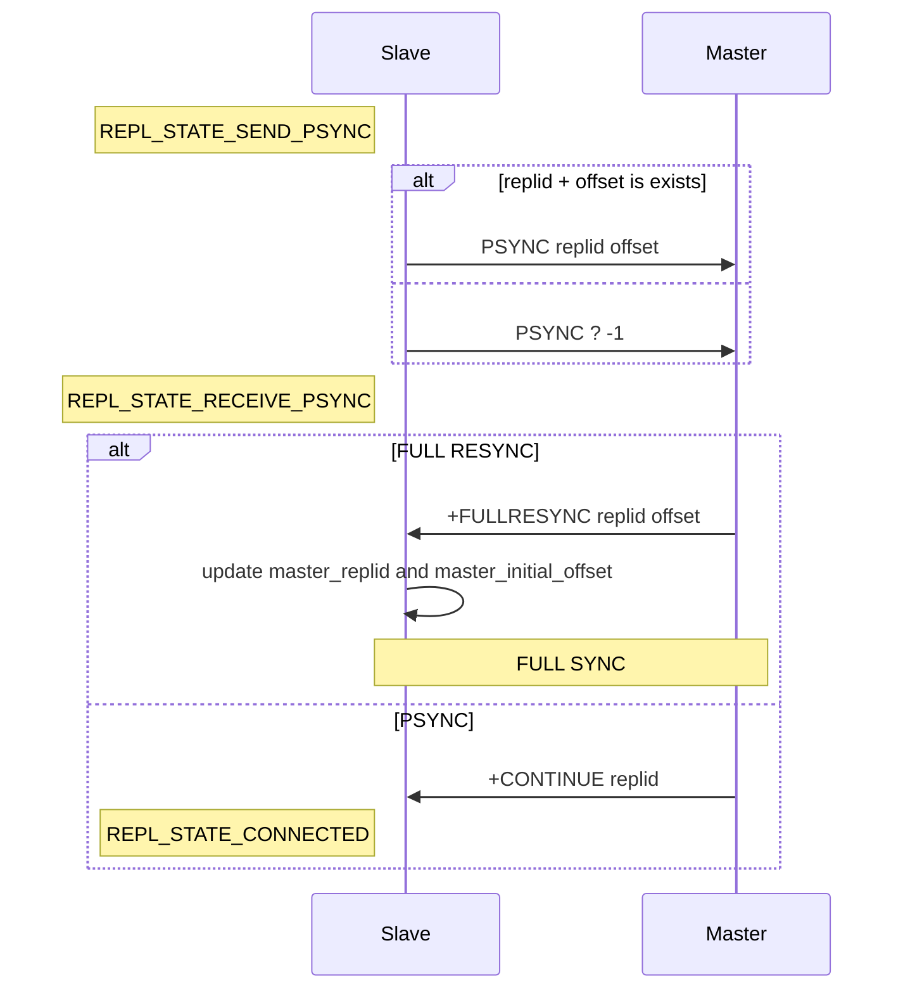
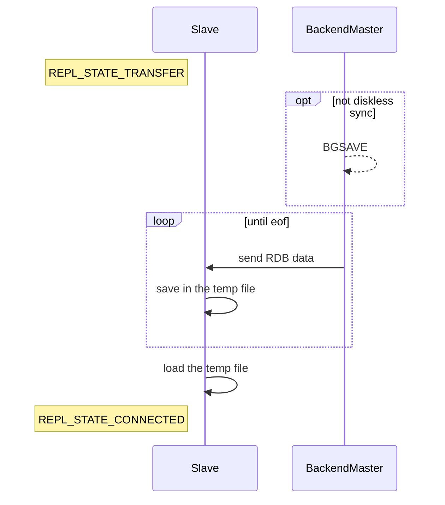
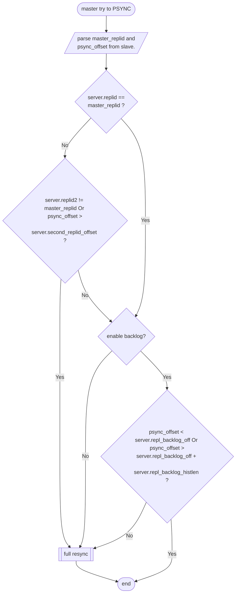
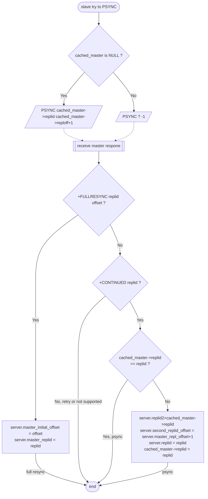

<style>
    p { font: 0.875rem YaHei !important; }
</style>

# Redis psync protocol

redis老版本的同步协议是 `SYNC`，因为它不支持部分同步所以被`PSYNC`代替，发展出了 `psync1`协议。后续为优化由 `failover` 带来的不必要`full Resynchronization`，发展出了 `psync2` 协议。下面的内容是基于 `redis 5.0` 版本，剖析一下 `psync2` 协议的实现。

## replication handshake

slave 与 master 之前发起同步的过程称为 **replication  handshake**， 在 `slave node` 的 [replicationCron](https://github.com/redis/redis/blob/5.0/src/replication.c#L2578) 任务（每秒调用一次）中会调用 `connectWithMaster -> registry file event[syncWithMaster -> slaveTryPartialResynchronization]` 函数与 `master node` 完成 `replication  handshake` 过程，具体的握手流程实现在[syncWithMaster](https://github.com/redis/redis/blob/5.0/src/replication.c#L1643)函数中。下面展示的是 `slave node`进入 `REPL_STATE_SEND_PSYNC`状态后的交互流程，在此之前，`slave` 和 `master`已经依次执行了如下流程：

1. slave 向 master 发起 tcp 链接；
2. slave 向 master 发送 `PING` 命令，master 响应是否需要AUTH，即返回 `-NOAUTH`，如果需要执行 3，否则跳转到 4；
3. slave 向 master 发送 `AUTH masterauth`，master 响应是否认证成功；
4. slave 发送 `REPLCONF listening-port port` （如果 `slave_announce_port` 不存在，则发送`tcp listening port`）；如果`slave_announce_ip` 不为 NULL 则发送 `REPLCONF ip-address slave_announce_ip`
5. slave 向 master 同步当前支持的能力，发送 `REPLCONF capa eof capa psync2`。

从 1~5 过程中，slave 状态依次经过如下变迁： `REPL_STATE_NONE -> REPL_STATE_CONNECT -> REPL_STATE_CONNECTING -> REPL_STATE_RECEIVE_PONG -> REPL_STATE_SEND_AUTH -> REPL_STATE_RECEIVE_AUTH -> REPL_STATE_SEND_PORT -> REPL_STATE_RECEIVE_PORT -> REPL_STATE_SEND_IP -> REPL_STATE_RECEIVE_IP -> REPL_STATE_SEND_CAPA -> REPL_STATE_RECEIVE_CAPA -> REPL_STATE_RECEIVE_PSYNC`



当 `master` 返回`+CONTINUE replid`时，`slave node` 进入 `REPL_STATE_CONNECTED`状态，开始接收 `master node` 同步过来的命令。

执行`Full Resynchronization` 时 `Master node` 会调用 `fork()` 创建一个`Backend Process` 与 `Slave Nodes` 进行同步通信，避免阻塞`Master node`对外提供服务：




在全量同步时 `backend save process` 会先生成一个 `RDB file` 保存在磁盘里，然后再从磁盘中将文件加载到内存同步给`slave nodes`。与此同时它会缓冲当前收到的 `client command`，当 `RDB file` 数据传输完成后，`master` 会把缓冲的 `command` 全部发送给 `slave` 。**如果并发有多个全量同步请求，`master` 只会 `fork` 一个 `backend process` 去服务所有请求**，当无法附加到当前的 `BGSAVE` 流程时（`slave capability`与开启当前`BGSAVE`流程的 `slave node` 不同），需要去等待下一个 `BGSAVE` 或 `SYNC`(详情见[syncCommand](https://github.com/redis/redis/blob/5.0/src/replication.c#L629)函数)。

当 `master node` 所在宿主机的磁盘读写速度较慢时，会对`master node`带来额外的压力，为了解决这个问题，在2.8.18以后的版本支持不使用磁盘作为中间存储的介质，直接在`backend process`中通过网络发送到给其他的`slave nodes`（前提是在 `slave nodes` 支持 `eof capability` 的情况下，在 `replication shake`过程中通过 `REPLCONF`命令同步 `slave capability`），可以通过`repl-diskless-sync`开启这个选项。**在diskless模式下，为了延迟几秒等待更多的slave nodes 全量同步请求到达，backend process不会立即创建， 而是放在 replicationCron()中被创建**，如果已经被启动，则需要等待下一个 `BGSAVE` 或 `SYNC`(详情见[syncCommand](https://github.com/redis/redis/blob/5.0/src/replication.c#L629)函数)。

`backend save process`执行同步的结果（与slave全量同步是否成功）会通过`pipe`被父进程（服务进程）接收，服务进程根据返回结果来决定对每个slave同步的后续处理流程（是否进入增量同步流程）[^3]。

`master` 判断是否直接通过 `socket` 发送 `RDB` 数据的代码 [startBgsaveForReplication](https://github.com/redis/redis/blob/5.0/src/replication.c#L564) 如下：

``` C

int startBgsaveForReplication(int mincapa) {
    int retval;
    // 需要 master 开启 repl_diskless_sync 选项，同时 slave 支持 SLAVE_CAPA_EOF
    int socket_target = server.repl_diskless_sync && (mincapa & SLAVE_CAPA_EOF); 
    listIter li;
    listNode *ln;

    serverLog(LL_NOTICE,"Starting BGSAVE for SYNC with target: %s",
        socket_target ? "replicas sockets" : "disk");

    rdbSaveInfo rsi, *rsiptr;
    rsiptr = rdbPopulateSaveInfo(&rsi);
    /* Only do rdbSave* when rsiptr is not NULL,
     * otherwise slave will miss repl-stream-db. */
    if (rsiptr) {
        // 需要支持 socket_target;
        if (socket_target) 
            retval = rdbSaveToSlavesSockets(rsiptr);
        else
            retval = rdbSaveBackground(server.rdb_filename,rsiptr);
    } else {
        serverLog(LL_WARNING,"BGSAVE for replication: replication information not available, can't generate the RDB file right now. Try later.");
        retval = C_ERR;
    }
}

```

`slave` 接收并加载`RDB`数据的具体实现在[readSyncBulkPayload](https://github.com/redis/redis/blob/5.0/src/replication.c#L1141)中。需要注意的是，当完成上面的 `RDB Full Resynchronization` 流程后，`slave`会变更为`REPL_STATE_CONNECTED`状态，完成 `replication  handshake`。

从上述的过程可以看出 `replid + offset` 是整个复制流程最核心的要素，下面会围绕它们去展开，来对实现细节进一步发掘。

在进入下一节前在此提出几个问题：

1. replid 是如何产生的？它是如何在节点之间同步的？

2. offset时如何统计的？failover后，新的 master 节点是否会继承 failover 前的 offset 记录向继续向上递增？

3. backlog的作用是什么？节点在 slave 角色下是否会开启 backlog？

4. 在发生 failover 后如何继续 psync？

## Replication ID

每一个 `master node` 都拥有一个 `replication id`（用一个巨大的随机数来标记指定的 `dataset` 的 `story` ），`master node`向 `slave node` 每发送一个byte都会增加`offset`，简单的说就是用`replication id + offset`构成一个同步状态的标识和记录。如上节所述当 `slave node` 连接到 `master node` 进行 `replication handshake` 时，使用 `PSYNC` 命令将 `replication id + offset` 发送给 `master node`，`master node`可以根据该信息，只将更新的部分发送给 `slave node` 。

下面给出[redisServer](https://github.com/redis/redis/blob/5.0/src/server.h#L942)中与数据同步相关的部分字段：

``` C
#define CONFIG_RUN_ID_SIZE 40

struct redisServer{
    ... ...
    /* Replication (master) */
    char replid[CONFIG_RUN_ID_SIZE+1];  /* 当前的 replication ID. */
    char replid2[CONFIG_RUN_ID_SIZE+1]; /* 继承自 failover 前的 master*/
    long long master_repl_offset;   /* 当前的 replication offset */
    long long second_replid_offset; /* 对于 replid2 可以接受的最大偏移量上限. */
    ... ...
    char *repl_backlog;             /* 用于部分同步的 backlog  */
    long long repl_backlog_size;    /* backlog ringbuffer size */
    long long repl_backlog_histlen; /* backlog 实际数据长度 */
    long long repl_backlog_idx;     /* backlog ringbuffer 下一个写入位置.*/
    long long repl_backlog_off;     /* backlog buffer的第一个字节对应 复制集“master offset”*/
    ... ...
    client *master;     /* 对应master的Client对象 */
    client *cached_master; /* 为了用于 PSYNC 而缓存的 master client对象.*/
    ... ...
    // 下面两个字段是用于记录 PSYNC 过程中 master node 的 replid/offset
    // 最终会把它们记录到 server->master 对象中
    char master_replid[CONFIG_RUN_ID_SIZE+1];  /* Master PSYNC runid. */
    long long master_initial_offset;           /* Master PSYNC offset. */
}

```

`master node` 对于是否满足`PSYNC`的判断条件具体实现在[masterTryPartialResynchronization](https://github.com/redis/redis/blob/5.0/src/replication.c#L448)函数：

``` C
/* This function handles the PSYNC command from the point of view of a
 * master receiving a request for partial resynchronization.
 *
 * On success return C_OK, otherwise C_ERR is returned and we proceed
 * with the usual full resync. */
int masterTryPartialResynchronization(client *c) {
    ... ...
     /* Is the replication ID of this master the same advertised by the wannabe
     * slave via PSYNC? If the replication ID changed this master has a
     * different replication history, and there is no way to continue.
     *
     * Note that there are two potentially valid replication IDs: the ID1
     * and the ID2. The ID2 however is only valid up to a specific offset. */
    if (strcasecmp(master_replid, server.replid) &&
        (strcasecmp(master_replid, server.replid2) ||
         psync_offset > server.second_replid_offset))
    {
        /* Run id "?" is used by slaves that want to force a full resync. */
        if (master_replid[0] != '?') {
            if (strcasecmp(master_replid, server.replid) &&
                strcasecmp(master_replid, server.replid2))
            {
                serverLog(LL_NOTICE,"Partial resynchronization not accepted: "
                    "Replication ID mismatch (Replica asked for '%s', my "
                    "replication IDs are '%s' and '%s')",
                    master_replid, server.replid, server.replid2);
            } else {
                serverLog(LL_NOTICE,"Partial resynchronization not accepted: "
                    "Requested offset for second ID was %lld, but I can reply "
                    "up to %lld", psync_offset, server.second_replid_offset);
            }
        } else {
            serverLog(LL_NOTICE,"Full resync requested by replica %s",
                replicationGetSlaveName(c));
        }
        goto need_full_resync;
    }
    ... ...
}
```

在 redis 节点中通过 `info replication` 命令查询可能会看到两个 `replication id` ：`master` 和 `secondary` ，两者作用分别如下：

+ master : 当前的`replication id`，用于标识目前状态最新的 `replicas`；
+ sencondary : `failover` 前的 `replication id`，是节点在变更为主节点之前标识`replicas`的`id`；

如果 `slave node` 的 `replicationID` 与 `replid` 不同，同时与 `replid2` 不同或 `psync_offset > second_replid_offset`，则执行全量同步。如果 `master node` 是刚刚完成 `failover`由 `slave node` 切换而来，此时 `second_replid_offset = master_repl_offset + 1`（下文有详细阐述）。在redis集群中，当网络情况正常时（未发生集群网络分裂）`offset` 最大的 `slave node` 会被其他 `slave nodes` 选为新的 `master node`。此时其他的从节点发送 `PSYNC replicationID offset` 过来，可以避免跳转到全量同步进入下面的流程：

``` C
    /* We still have the data our slave is asking for? */
    if (!server.repl_backlog ||
        psync_offset < server.repl_backlog_off ||
        psync_offset > (server.repl_backlog_off + server.repl_backlog_histlen))
    {
        serverLog(LL_NOTICE,
            "Unable to partial resync with replica %s for lack of backlog (Replica request was: %lld).", replicationGetSlaveName(c), psync_offset);
        if (psync_offset > server.master_repl_offset) {
            serverLog(LL_WARNING,
                "Warning: replica %s tried to PSYNC with an offset that is greater than the master replication offset.", replicationGetSlaveName(c));
        }
        goto need_full_resync;
    }
```

当 `master node` 没有开启 `backlog` 或 `psync_offset` 不在 `backlog` 范围内时，会直接触发全量同步。**如果任意两个节点的`replication id + offset`相等，说明两个节点之间的数据相同**。整体的流程如下：




在发生主从切换后，`slave nodes` 会向新的`master`发送旧的`replication id + offset`，此时新的`master`节点收到后会与`master relication id` 和 `secondary replication id`进行对比，如果对比发现`slave node`发送的`replication id + offset`与 `secondary replication id + offset`匹配且偏差在一定安全范围，则不需要进行全量同步。

上面给出的是`master node`视角的处理流程，下面讲一下`slave node`视角的处理流程。

在 `PSYNC` 初始化的阶段（`PSYNC handshark`） `slave node` 会调用 [slaveTryPartialResynchronization(master_fd, 0)](https://github.com/redis/redis/blob/5.0/src/replication.c#L1483) 函数将自己的 `replicationID + offset` 通过 `PSYNC` 命令发送给 `master node`，如果 `cached_master` 无效，则发送 `PSYNC ? -1` 给 `master node` 会直接触发全量同步：

``` C
int slaveTryPartialResynchronization(int fd, int read_reply) {
    ... ...
    if (!read_reply) {
    /* Initially set master_initial_offset to -1 to mark the current
        * master run_id and offset as not valid. Later if we'll be able to do
        * a FULL resync using the PSYNC command we'll set the offset at the
        * right value, so that this information will be propagated to the
        * client structure representing the master into server.master. */
        server.master_initial_offset = -1;

        if (server.cached_master) {
            psync_replid = server.cached_master->replid;
            snprintf(psync_offset,sizeof(psync_offset),"%lld", server.cached_master->reploff+1);
            serverLog(LL_NOTICE,"Trying a partial resynchronization (request %s:%s).", psync_replid, psync_offset);
        } else {
            serverLog(LL_NOTICE,"Partial resynchronization not possible (no cached master)");
            psync_replid = "?";
            memcpy(psync_offset,"-1",3);
        }

        /* Issue the PSYNC command */
        reply = sendSynchronousCommand(SYNC_CMD_WRITE,fd,"PSYNC",psync_replid,psync_offset,NULL);
        if (reply != NULL) {
            serverLog(LL_WARNING,"Unable to send PSYNC to master: %s",reply);
            sdsfree(reply);
            aeDeleteFileEvent(server.el,fd,AE_READABLE);
            return PSYNC_WRITE_ERROR;
        }
        return PSYNC_WAIT_REPLY;
    }
    ... ...
}
```

在接收`master node` 应答时，会调用`slaveTryPartialResynchronization(master_fd, 1)`去解析服务端的响应：

``` C
int slaveTryPartialResynchronization(int fd, int read_reply) {
    ... ...
    if (!strncmp(reply,"+FULLRESYNC",11)) { 
        // 全量同步 
        char *replid = NULL, *offset = NULL;

        /* FULL RESYNC, parse the reply in order to extract the run id
         * and the replication offset. */
        ... ...
        // 保留 master 发送的 replid
        // server.master_replid = replid
        memcpy(server.master_replid, replid, offset-replid-1);
        server.master_replid[CONFIG_RUN_ID_SIZE] = '\0';
        // 保留 master 发送的 offset
        // server.master_initial_offset = offset
        server.master_initial_offset = strtoll(offset,NULL,10);
        ... ...
        return PSYNC_FULLRESYNC;
    }

    if (!strncmp(reply,"+CONTINUE",9)) {
        // 开启增量同步
        ... ... 
        // 比较 master 返回的 replid 与 slave 当前保留的 replid
        // 在发生 failover 或 master 更新 replid 时会触发
        if (strcmp(new,server.cached_master->replid)) {
            
            /* Master ID changed. */
            serverLog(LL_WARNING,"Master replication ID changed to %s",new);

            /* Set the old ID as our ID2, up to the current offset+1. */
            // 保留 上一个周期的 replid
            // server.replid2 = cached_master->replid
            memcpy(server.replid2,server.cached_master->replid,
                sizeof(server.replid2));
            // 保留 上一个周期的 offset
            server.second_replid_offset = server.master_repl_offset+1;

            /* Update the cached master ID and our own primary ID to the
                * new one. */
            // 更新 replid
            // server.replid = new replid
            // server.cached_master->replid = new replid
            memcpy(server.replid,new,sizeof(server.replid));
            memcpy(server.cached_master->replid,new,sizeof(server.replid));

            /* Disconnect all the sub-slaves: they need to be notified. */
            disconnectSlaves();
        }
        ... ... 
    }
    ... ...
}
```

如果返回结果为 `+FULLRESYNC` 则直接更新`master_replid` 和 `master_initial_offset`，后续进入全量同步流程；如果返回 `+CONTINUE` 说明可以进入增量同步流程，同时将 `master node` 返回的 `replid` 与当前的 `cached_master->replid` 进行比较，来决定是否更新 `server.replid` 和 `cached_master->replid`。整体流程如下：



`replid2` 来源除上面提到的情况，还有一种情况是在发生`failover`时，候选的`slave node`主动保留上一轮的`replicas id + offset`，其具体实现在[replicationUnsetMaster](https://github.com/redis/redis/blob/5.0/src/replication.c#L448)函数，下面会阐述`failover`时与`psync`有关的细节。

在上述的流程中，参与`PSYNC`判断的 `replid`如下：
master 视角：

+ server.replid
+ server.replid2

slave 视角：

+ cached_master->replid

`server.replid` 赋值来源：

+ master 视角：
    1. 开启新的 `replication story`，生成新`replid`（详情见`changeReplicationId` 函数）；
    2. 节点可以在重启时使用 [loadDataFromDisk](https://github.com/redis/redis/blob/5.0/src/server.c#L4067)函数从 `RDB` 文件中恢复同步的 `metadata`，对 `replid` 进行初始化（将 `rsi.repl_id,` 赋值给 `replid`）；
+ slave 视角：
    1. 执行 `replication shake`，当`master node`开启新的 `replication story`时，更新`replid`为`new replid`（详情见`slaveTryPartialResynchronization`函数）；
    2. 执行完 `full resync` 后将 `master->replid` 赋值给 `replid` (详情见 `readSyncBulkPayload`)；
    3. 节点可以在重启时使用 [loadDataFromDisk](https://github.com/redis/redis/blob/5.0/src/server.c#L4067)函数从 `RDB` 文件中恢复同步的 `metadata`，对 `replid` 进行初始化（将 `rsi.repl_id,` 赋值给 `replid`）；

`server.replid2` 赋值来源：

+ master 视角：发生`failover`，提升为`master node`，将上一轮的 `server.replid`赋值给`server.replid2`（详情见`shiftReplicationId`函数）；
+ slave 视角：执行 `replication shake`，当`master node`开启新的 `replication story`时，将上一轮的 `cached_master->replid`赋值给`server.replid2`（详情见`slaveTryPartialResynchronization`函数）；

`cached_master->replid` 赋值来源：

+ master 视角：发生 failover 后 `master node` 切换为 `slave node`，将 `service.replid` 赋值给 `cached_master->replid`（此时为了与 `new master node` 执行 `replication handshake`，以自身为蓝本创建一个 `cached_master`，详情见`replicationCacheMasterUsingMyself`函数）；

+ slave 视角：
    1. 执行完 `full resync` 将 `master_replid`（`master node` 通过 `+FULLRESYNC` 命令发送的`replid`） 赋值给 `master->replid`，当发生 `failover` 时 `master client` 会被 cache 为`cached_master client`（详情见`replicationCreateMasterClient`函数）；
    2. 执行 `replication shake`，当`master node`开启新的 `replication story`时，更新`cached_master->replid`为`new replid`（详情见`slaveTryPartialResynchronization`函数）；

  

`redisServer`作为一个通用结构体，即会在 `slave` 角色下使用也会在 `master` 角色下使用。在 failover 的情况下会发生角色的转换，所以要分两个视角阐述赋值来源。

同时要考虑另一种情况，即一个`slave node`也可能存在依附于它的`slave node`，所以弄清楚上面涉及的 `replid` 来源，也对下面针对这种情况的分析有好处。

到此可以回答上面提出的第一个问题：

1. replid 是如何产生的？它是如何在节点之间同步的？

    replid是由随机函数生成的长达40bytes的id，它在replication shake 期间， `master node` 通过 `+FULLRESYNC` 或 `+CONTINUE` 命令发送给 `slave node`，`slave node` 通过 `PSYNC` 命令向 `master node` 出示自己当前对应的 replicas id。

本节讲述了`replid`的产生、流转和作用，下面讲述 `replicas` 中`offset` 如何维持全局统计。

## offset

参与 `PSYNC` 流程判断的 `offset` 如下：

master 视角：

+ server.second_replid_offset
+ server.repl_backlog_off

slave 视角：

+ cached_master->reploff

cached_master->reploff 赋值来源：

+ slave 视角：
    1. 更新从 master 接收并成功执行的数据偏移量（详情见 `processInputBuffer` 函数）；
    2. 执行完 `fullresync` 后将 `server.master_initial_offset` 赋值给 `master->reploff`（详情见 `replicationCreateMasterClient` 函数）；

    注意：以上都是在 `master client` 中得到的赋值，而后 `master client` 转化为 `cached_master client`。

server.second_replid_offset：

+ master 视角：
    在 failover 过程中，节点的角色由 `slave` 切换到 `master` ，将 `server.master_repl_offset+1`赋值给`server.second_replid_offset`（详情见 `shiftReplicationId` 函数）；
+ slave 视角：
   执行 `replication shake`，当`master node`开启新的 `replication story`时，将 `server.master_repl_offset+1`赋值给`server.second_replid_offset` (详情见`slaveTryPartialResynchronization`函数）；

注意：将`master_repl_offset+1`赋值给 `second_replid_offset` 是由于 `slave` 会将它期望收到数据的首字节 `offset` 发给依附的`master node`。假设两个节点相同的数据为 50 bytes，则下次 `slave` 在 `PSYNC`中发送的 `offset` 为 51。

server.repl_backlog_off：

+ master 视角：
    1. 开启了 `backlog` 时，会将接收到 `client` 端下发的命令缓冲在 `backlog` 中，将 `backlog` 中**首字节的偏移量**赋值给 `server.repl_backlog_off`（详情见`feedReplicationBacklog`函数）；

    2. 在创建 `backlog` 和 重置 `backlog size` 时，将`master_repl_offset+1` 赋值给 `server.repl_backlog_off`（详情见`createReplicationBacklog` 和 `resizeReplicationBacklog` 函数）；
+ slave 视角：
    1. 开启了 `backlog` 时，会将接收到的`master` 端同步的数据缓冲在 `backlog` 中，将 `backlog` 中**首字节的偏移量**赋值给 `server.repl_backlog_off`（详情见`feedReplicationBacklog`函数）；

    2. 在创建 `backlog` 和 重置 `backlog size` 时，将`master_repl_offset+1` 赋值给 `server.repl_backlog_off`（详情见`createReplicationBacklog` 和 `resizeReplicationBacklog` 函数）；

上述的字段中依赖 `server.master_repl_offset`，其赋值来源如下：

+ master 视角：
    1.开启了 `backlog` 时，会将接收到 `client` 端下发的命令缓冲在 `backlog` 中，将接收到数据的最末端byte对应的 `offset` 赋值给 `server.master_repl_offset`(详情见`feedReplicationBacklog`函数）；
+ slave 视角：
    1.开启了 `backlog` 时，会将接收到的`master` 端同步的数据缓冲在 `backlog` 中，将接收到数据的最末端byte对应的 `offset` 赋值给 `server.master_repl_offset`(详情见`feedReplicationBacklog`函数）；
    2. 完成 `full resync` 后将 `server.master->reploff` 赋值给 `server.master_repl_offset`(详情见 `readSyncBulkPayload` 函数)；
    3.节点可以在重启时使用 [loadDataFromDisk](https://github.com/redis/redis/blob/5.0/src/server.c#L4067)函数从 `RDB` 文件中恢复同步的 `metadata`，对 `master_repl_offset` 进行初始化（将 `repl_offset` 赋值给 `master_repl_offset`）
    注意：redis节点重启后，replication meta 数据可以从 RDB 文件中恢复，当使用 Aof 格式的日志格式时无法支持此功能。可以使用`SHUT DOWN`命令去关闭节点同时生成一个 RDB 文件，这在节点更新的时候很有用，在重启恢复内存后可以使用部分同步继续更新数据（在条件满足的情况下）。

当发生 `failover` 时，提升 `slave` 到 `master` 的过程中 `master_repl_offset` 不会被修改，即`new master` 会延续之前的 `offset` 继续递增。

 

至此可以回答上面第二个问题：

2. offset是如何统计的？failover后，新的 master 节点是否会继承 failover 前的 offset 记录向继续向上递增？

    redisServer 中有多处 `offset`，对于 `master` 而言最重要的是`master_repl_offset`，这是用于记录当前同步数据的最高水位，在向 `backlog`中写入数据时会按 data_bytes_len 向上累加 ；对于 `slave` 而言最重要的是 `master->reploff`，这是用于记录同步完成（即已经被成功执行）数据的最高水位，会按同步成功数据的 data_bytes_len 向上累加。

    在 failover 后，`new master` 会继承上一轮的 `offset` 继续向上累加。

## backlog

`backlog` 的是一个基于连续内存的`ringbuff`，下面简单讲解一下它的实现。

1. 初始化一个 size 为 10 的`backlog`，如下图所示：

    

2. 向其中写入 5 bytes 数据，如下图所示：

    

    此时`backlog`尚未写满，`backlog_off`不会发生变动。

3. 继续向其中写入 8 bytes 数据，如下图所示：

    

其具体实现如下：

``` C
/* Add data to the replication backlog.
 * This function also increments the global replication offset stored at
 * server.master_repl_offset, because there is no case where we want to feed
 * the backlog without incrementing the offset. */
void feedReplicationBacklog(void *ptr, size_t len) {
    unsigned char *p = ptr;

    server.master_repl_offset += len;

    /* This is a circular buffer, so write as much data we can at every
     * iteration and rewind the "idx" index if we reach the limit. */
    while(len) {
        size_t thislen = server.repl_backlog_size - server.repl_backlog_idx;
        if (thislen > len) thislen = len;
        memcpy(server.repl_backlog+server.repl_backlog_idx,p,thislen);
        server.repl_backlog_idx += thislen;
        if (server.repl_backlog_idx == server.repl_backlog_size)
            server.repl_backlog_idx = 0;
        len -= thislen;
        p += thislen;
        server.repl_backlog_histlen += thislen;
    }
    if (server.repl_backlog_histlen > server.repl_backlog_size)
        server.repl_backlog_histlen = server.repl_backlog_size;
    /* Set the offset of the first byte we have in the backlog. */
    server.repl_backlog_off = server.master_repl_offset -
                              server.repl_backlog_histlen + 1;
}
```

对于 `master` 和 `slave` 角色的节点而言，只有在调用 [feedReplicationBacklog](https://github.com/redis/redis/blob/5.0/src/replication.c#L127) 函数时会增长该字段，即只有在向 `backlog` 中添加数据的时候。

不同的是 `master` 是在接收客户端命令时会在 [replicationFeedSlaves](https://github.com/redis/redis/blob/5.0/src/replication.c#L174) 函数中执行 `backlog` 备份，`slave` 是在 [replicationFeedSlavesFromMasterStream](https://github.com/redis/redis/blob/5.0/src/replication.c#L279) 函数中执行备份，用于支持依附在该节点上的  `sub-slaves` 的部分同步需求。

``` C
/* Propagate write commands to slaves, and populate the replication backlog
 * as well. This function is used if the instance is a master: we use
 * the commands received by our clients in order to create the replication
 * stream. Instead if the instance is a slave and has sub-slaves attached,
 * we use replicationFeedSlavesFromMaster() */
void replicationFeedSlaves(list *slaves, int dictid, robj **argv, int argc) {
    ... ...
}

/* This function is used in order to proxy what we receive from our master
 * to our sub-slaves. */
#include <ctype.h>
void replicationFeedSlavesFromMasterStream(list *slaves, char *buf, size_t buflen) {
    ... ...
}
```

backlog的创建是通过 [createReplicationBacklog](https://github.com/redis/redis/blob/5.0/src/replication.c#L78) 函数：

``` C
void createReplicationBacklog(void) {
    serverAssert(server.repl_backlog == NULL);
    server.repl_backlog = zmalloc(server.repl_backlog_size);
    server.repl_backlog_histlen = 0;
    server.repl_backlog_idx = 0;

    /* We don't have any data inside our buffer, but virtually the first
     * byte we have is the next byte that will be generated for the
     * replication stream. */
    server.repl_backlog_off = server.master_repl_offset+1;
}
```

其调用的场景如下：

1. `syncCommand`函数：执行 `PSYNC` 命令，当前`backlog ==NULL && listLength(server.slaves) == 1`，则创建 `backlog`：

    ``` C
    // 此时进入 FULLRESYNC 后续流程
    c->flags |= CLIENT_SLAVE;
    listAddNodeTail(server.slaves,c);

    /* Create the replication backlog if needed. */
    // 当 backlog 为空，且当前 client 是唯一的 slave，初始化 backlog；
    if (listLength(server.slaves) == 1 && server.repl_backlog == NULL) {
        /* 因为新的backlog没有与过去相关的历史记录，
         * 所以在创建新的backlog的同时去更新replid并清理replid2 */
        changeReplicationId();
        clearReplicationId2();
        createReplicationBacklog();
    }
    ```

2. `readSyncBulkPayload`函数：执行完全量同步后开启`backlog`：

    ``` C
    if (eof_reached) {
        ... ...
        /* slave node 是否需要创建 backlog 
         * 与是否有 sub-slaves node 无关，开启 
         * backlog 主要是为了在切换为 master 时可以
         * 支持 psync. */
        if (server.repl_backlog == NULL) createReplicationBacklog();
        ... ...
    }
    ```

3. `slaveTryPartialResynchronization` 函数：尝试执行部分同步，在返回`+CONTINUE` 后初始化 `backlog`：

    ``` C
    if (!strncmp(reply,"+CONTINUE",9)) {
        ... ...
         /* 即使实例重启后从RDB文件中恢复了PSYNC metadata，
          * 也无法初始化 backlog，需要创建它*/
        if (server.repl_backlog == NULL) createReplicationBacklog();
        return PSYNC_CONTINUE;
    }
    ```

综上对于 `master` 而言，某些情况可能会不开启 `backlog`；对于 `slave` 而言无论是否有`sub-slaves` 都会开启 `backlog`（在支持PSYNC 协议的前提下）。

`backlog`的释放是通过 [freeReplicationBacklog](https://github.com/redis/redis/blob/5.0/src/replication.c#L117) 函数：

``` C
void freeReplicationBacklog(void) {
    serverAssert(listLength(server.slaves) == 0);
    zfree(server.repl_backlog);
    server.repl_backlog = NULL;
}
```

其调用场景如下：

1. `replicationCron` 函数：当master没有slave且超过一段时间（**由配置指定，如果为0则不会被释放**）后，会释放`backlog`空间：

    ``` C
    ... ...
    /* 如果一个master 没有 slaves，
     * 为了节省内存可以在一定时间过后回释放`backlog`占用的内存，
     * 但是 slave 不可以执行这种操作。 */
    if (listLength(server.slaves) == 0 && server.repl_backlog_time_limit &&
        server.repl_backlog && server.masterhost == NULL)
    {
        time_t idle = server.unixtime - server.repl_no_slaves_since;

        if (idle > server.repl_backlog_time_limit) {
            /* 当释放 backlog的时候，需要更新 replid 并清理 replid2。
             * 当backlog不存在时 master_repl_offset 无法更新，
             * 如果此时仍然保持replid不变可能会造成以下的问题：
             * 1. 当前角色为 master
             * 2. 某个 slave 被切换为 new master，
             * 它的 replid2 与 当前 replid 相同
             * 3. 此时仍然是 master 未切换为 slave，并接收了写入命令，
             * 但是 master_repl_offset 没有更新
             * 4. 切换为 slave，由于接受了写入此时数据不一致，
             * 此时向 new master 发起 PSYNC 请求会被接受，
             * 返回 +CONTINUE new_replid。
            */
            changeReplicationId();
            clearReplicationId2();
            freeReplicationBacklog();
            serverLog(LL_NOTICE,
                "Replication backlog freed after %d seconds "
                "without connected replicas.",
                (int) server.repl_backlog_time_limit);
        }
    }
    ```

2. `syncWithMaster`函数：当 `slave` 执行 PSYNC 失败（由于master不支持，或者校验未通过），需要清理 `backlog`，强制 sub-slaves 执行 resync。

    ``` C
        ... ...
        if (psync_result == PSYNC_CONTINUE) {
            serverLog(LL_NOTICE, "MASTER <-> REPLICA sync: Master accepted a Partial Resynchronization.");
            return;
        }

        /* 当 PSYNC 失败或不支持时，如果当前节点有 sub-slaves，
         * 则希望 sub-slaves 与 当前节点一起执行 resync。
         * master 可能传输给当前节点完全不同的data set，
         * 此时无法再去为sub-slaves 提供增量同步的服务。 */
        disconnectSlaves(); /* 强制 sub-slaves 执行 resync. */
        freeReplicationBacklog(); /* 释放 backlog，使得  sub-slaves 无法执行 PSYNC. */
        ... ...
    ```

`backlog` 的size调整是通过 [resizeReplicationBacklog](https://github.com/redis/redis/blob/5.0/src/replication.c#L96) 函数：

``` C
/* This function is called when the user modifies the replication backlog
 * size at runtime. It is up to the function to both update the
 * server.repl_backlog_size and to resize the buffer and setup it so that
 * it contains the same data as the previous one (possibly less data, but
 * the most recent bytes, or the same data and more free space in case the
 * buffer is enlarged). */
void resizeReplicationBacklog(long long newsize) {
    if (newsize < CONFIG_REPL_BACKLOG_MIN_SIZE)
        newsize = CONFIG_REPL_BACKLOG_MIN_SIZE; // 默认大小为 16*1024
    if (server.repl_backlog_size == newsize) return;

    server.repl_backlog_size = newsize;
    if (server.repl_backlog != NULL) {
        /* What we actually do is to flush the old buffer and realloc a new
         * empty one. It will refill with new data incrementally.
         * The reason is that copying a few gigabytes adds latency and even
         * worse often we need to alloc additional space before freeing the
         * old buffer. */
        zfree(server.repl_backlog);
        server.repl_backlog = zmalloc(server.repl_backlog_size);
        server.repl_backlog_histlen = 0;
        server.repl_backlog_idx = 0;
        /* Next byte we have is... the next since the buffer is empty. */
        server.repl_backlog_off = server.master_repl_offset+1;
    }
}
```

其调用场景如下：

1. `loadServerConfigFromString`函数：启动时加载配置项 repl-backlog-size；

2. `configSetCommand`函数：通过 config set repl-backlog-size size 命令；

到此可以回答上面提出的第3个问题：
3. backlog的作用是什么？节点在 slave 角色下是否会开启 backlog？

`backlog` 用于缓存 `client` 下发命令去支持 `PSYNC` 协议；`slave` 也会开启 `backlog`，除了用于服务 `sub-slaves`，还用于切换为主时提供`PSYNC`。

## failover

在这一小节主要专注于`failover`过程中，与 `replications` 相关的操作，failover的触发时机和选举机制会在其他章节中陈述。

当一个 `slave` 切换为 `master` 时会执行 [replicationUnsetMaster](https://github.com/redis/redis/blob/5.0/src/replication.c#L2018) 函数来清理 `old master` 信息并生成自己成为 `new master` 的相关信息：

``` C

/* 取消replications，设置自己为master. */
void replicationUnsetMaster(void) {
    if (server.masterhost == NULL) return; /* Nothing to do. */
    sdsfree(server.masterhost);
    server.masterhost = NULL;
    /* 当一个 slave 切换为master时，
     * 继承自前一任master的 replid 
     * 赋值给 sencondary ID，同时为
     * 新的 replication history 
     * 创建一个 new replid。 */
    shiftReplicationId();
    if (server.master) freeClient(server.master);
    replicationDiscardCachedMaster();
    cancelReplicationHandshake();
    /* 因为需要将当前 replid的变更传播给每一
     * sub-slaves，所以与所有 sub-slaves
     * 断开连接是必须的。
     * 由于可以执行 `PSYNC`重新开启复制流，
     * sub-slaves可快速重连. */
    disconnectSlaves();
    server.repl_state = REPL_STATE_NONE;

    /*需要确保 new master 以一个 SELECT 语句重启复制流*/
    server.slaveseldb = -1;
    
    /* 将当前时间视为没有 slaves 存在的起始时间，
     * 这个时间点用于统计backlog 的生存时间。
     * 如果不设置，当 slave 没有立即链接进来时，
     * backlog 可能会在 replicationCron 中被释放掉。 */
    server.repl_no_slaves_since = server.unixtime;
}
```

综上，在`slave` 提升为 `master` 时执行的步骤如下：

1. 清理 master_host，备份并生成新的 replid；
2. 释放 master 和 cached master client；
3. 取消 replication shake；
4. 与所有的 sub-slaves 断开链接；
5. 清理 slaveseldb 状态，更新 slave 不存在的时间为当前时间；

该函数调用的时机如下：

1. clusterFailoverReplaceYourMaster：执行 `cluster failover` 命令，或者执行自动故障转移（slave对应的master处于 FAIL 状态，发起自动故障转移）；
2. clusterReset：执行 `cluster reset` 命令；
3. replicaofCommand：执行`replicaof no one` 命令；

当 `master` 切换为 `slave` 时要执行[replicationSetMaster](https://github.com/redis/redis/blob/5.0/src/replication.c#L1993)函数，清理`relications`的状态并利用自身信息创建`cached_master`：

``` C
/* Set replication to the specified master address and port. */
void replicationSetMaster(char *ip, int port) {
    int was_master = server.masterhost == NULL;

    // 赋值 master ip、port
    sdsfree(server.masterhost);
    server.masterhost = sdsnew(ip);
    server.masterport = port;
    if (server.master) { 
        // 清理master client
        freeClient(server.master);
    }

    /* 断开所有阻塞. */
    disconnectAllBlockedClients(); 

    /* 强迫slave 重新建立 replications stream，
     *同步 replid 的更改。 */
    // 断开所有slaves；
    disconnectSlaves();
    // 取消 replication handshake；
    cancelReplicationHandshake();
    if (was_master) {
        // 清理 cached_master
        replicationDiscardCachedMaster();
        // 利用自身信息创建 cached master；
        replicationCacheMasterUsingMyself();
    }
    // 重置当前 repl_state 为 REPL_STATE_CONNECT；
    server.repl_state = REPL_STATE_CONNECT;
}
```

综上 `master` 切换为 `slave` 执行的步骤如下：

1. 保存 new master 的 host 信息
2. 断开所有处于`CLIENT_BLOCKED`状态的 `client` ， 向它们发送一个`-UNBLOCKED`的错误；
3. 断开所有的`slaves`，强迫其重新执行同步流程，切换到新的 `replication story`；
4. 清理 cached_master，利用自身信息创建 cached_master 用于 `PSYNC`；
5. 重置当前的 `repl_state` 状态为 `REPL_STATE_CONNECT`；

该函数的调用时机如下：

1. clusterUpdateSlotsConfigWith：更新槽的配置，当一个`master node`没有对应槽去服务时，会被迁移为其他 `master node`的`slave`；当一个 `slave node` 的`master node`没有槽分配时，会被切换到其他的 `slots owner`；
2. replicaofCommand：`master node`执行`slaveof ip port`命令(在 >=redis 5.0 的版本，使用`replicaof`替换；在cluster中不允许执行 `slaveof`和`replicaof`命令)，迁移为指定节点的`slave`；

到此可以回答上面提出的第4个问题：

4. 在发生 failover 后如何继续 psync ？
 
    在发生 failover 后一个 `slave node` 会提升为 `master node`(在哨兵模式下由哨兵选择一个`slave node`切换为`master node`，以优先级高的优先，优先级相同的情况下以 offset 高的优先，offset 相同的情况下以节点号小的优先；在集群模式下由同复制集中的`slave nodes`推举一个`slave node`，以 offset 大的优先，再由其他`master nodes` 去认证，在取得大多数 `master nodes` 认证后，完成切换。)，同时记录上一轮的 `replid` 为`replid2` 和 `master_repl_offset+1` 为 `second_replid_offset`（详情见[replicationUnsetMaster](https://github.com/redis/redis/blob/5.0/src/replication.c#L2018)函数）。
    当其他 `slave nodes` 去向 `new master node` 发送`PSYNC cache_master->replid cache_master->reloff+1` 去完成 `handshake` 流程时，可以满足 `server.replid2 == master_replid && psync_offset <=  server.second_replid_offset` 的判断条件。

## 参考文档

[^1]: 陈雷. Redis 5设计与源码分析, 北京, 机械工业出版社, July 2020

[^2]: Redis Ltd. Replication. Aguest 25 2020, https://redis.io/topics/replication

[^3]: Souvik. Redis diskless replication: What, how, why and the caveats. March 8 2020, https://deepsource.io/blog/redis-diskless-replication/